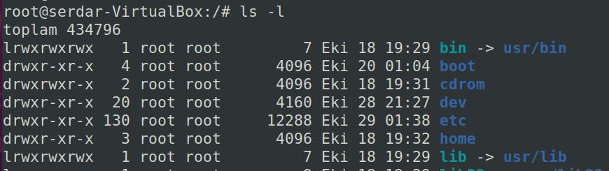
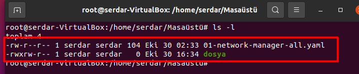
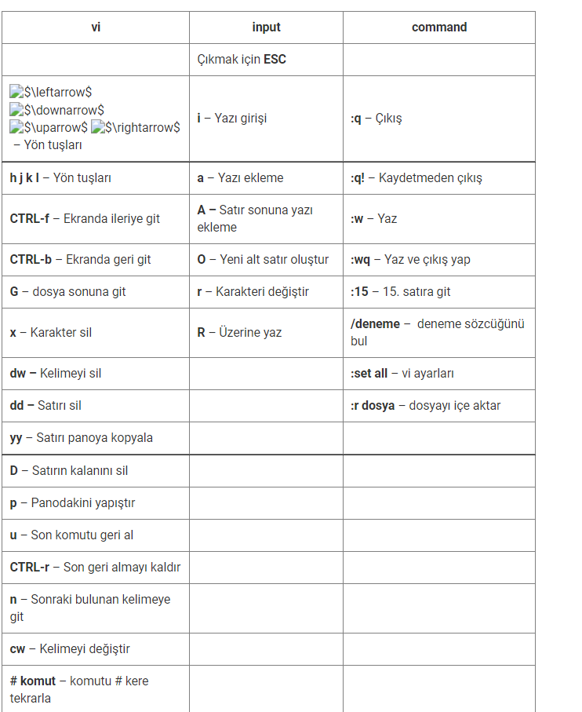
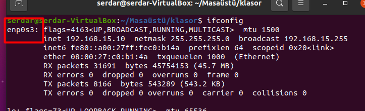
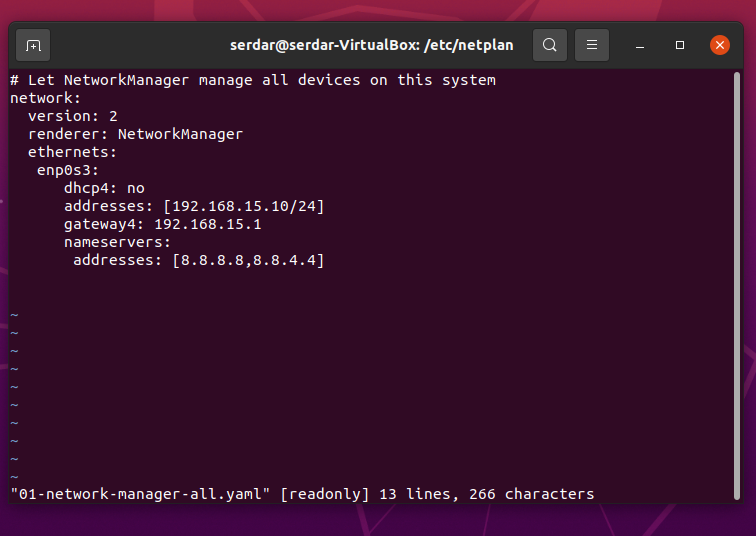

# **LINUX NEDİR**
Linux bilinenin aksine bir işletim sistemi değil, **işletim sistemi çekirdeğidir.** 

**Linux dağıtımları** ise Linux çekirdeğinin üzerine eklenen yazılım ve araçlara denir. Yani Linux dağıtımları Linux çekirdeğini işletim sistemi haline getirir.

Bir Linux dağıtımının içerisinde

- Linux çekirdeği
- GNU yazılımları
- Paket Yöneticisi

bulunmaktadır. 

Debian, Manjaro, Ubuntu, Manjaro gibi dağıtımlar Linux çekirdeği ve gerekli yazılımlar ile birleşip işletim sistemi haline gelmiştir.

Linux çekirdeği(Kernel) işletim sisteminin kalbidir. Sebebi ise **donanım ile yazılımı** birbirine bağlamaktadır. Yani bu durumda Linux çekirdeği donanımı sarmalamaktadır.

Bizim bilgisayarla iletişim kurabilmemiz ve emir verebilmemiz için çekirdeğe(kernel) ihtiyacımız vardır ancak bunu direkt olarak yapamayız. Komutlarımızı kernele ileterek işlemler yapmamızı sağlayan komut satırına ise **kabuk(shell)** denir.

Kısaca kabuk(shell) donanım ve çekirdeği(kernel) sarmalamaktadır.

Shell,  çekirdek ile kullanıcı arasında ki iletişimi sağlar. Böylece emirleri yerine getirebilir.

Linux’un kullandığı Shell aracı programı  Bourne Again Shell ifadesinin kısaltması olan **BASH**’dir. 
# **LINUX DİZİN HİYERARŞİSİ HAKKINDA BİLİNMESİ GEREKENLER**
Öncelikle Linux C: D: vb. sürücüleri bulundurmaz. **Tekil Hiyerarşik Dizin** Yapısını kullanır. 

Tekil hiyerarşik dizin yapısında tüm dosya, dizin, disk, işlemler vb. **eğik çizgi(/)** ile belirtilen, **kök dizin** veya ağaç yapısı olarak adlandırılan yapıda tutulur.

**Kök dizin(/)** adından da anlaşılacağı üzeri en başta ki dizindir ve altında herhangi bir dizin yoktur. Yani son ulaşabileceğimiz dizindir.

Tüm dizinlerin adının sonunda (/) simgesi bulunur ve bunun dizin olduğu anlamına gelir.

**Peki kök dizin içerisinde hangi dizinler bulunur.**
### **/bin**
İşletim sistemine ait komutların bulunduğu dizindir.

Linux dağıtımlarında sıklıkla kullanılan **ls, ping, mkdir vb. komutlar** bu dizin içerisinde yer alır.
### **/boot**
İşletim sistemini başlatılması için kullanılan Linux çekirdek dosyaları bu dizinde bulunur. Örneğin grub, lilo vb.
### **/etc**
**Linux işletim sisteminde ki en önemli dizindir.** Bu dizin içerisinde işletim sistemi ve uygulamaların ayarları bulunmaktadır.
### **/home**
Kullanıcılara ait dosyaların bulunduğu dizindir.

Yeni bir kullanıcı oluşturulduğunda /home dizini altında kullanıcı adına sahip bir dizin oluşturulur ve kullanıcı verilerini bu dizine yükler.

### **/lib ve /lib64**
Sistemdeki uygulamaların çalışabilmesi için gerekli olan kütüphane dosyaları bu dizinlerde yer alır. Linux türevi işletim sistemlerinde kütüphane dosyaları **.so** uzantılıdır.
### **/media**
Sistem üzerindeki CD-Rom, USB bellek vb. çıkarılabilir aygıtlara bu dizin üzerinde erişilir. Aygıtlara erişebilmek için bağlama (**mount**) işleminin yapılması gerekir.
### **/mnt**
Sistem üzerindeki çeşitli birimleri **geçici** olarak bağlama (**mount**) işleminin yapıldığı dizindir. Bu dizin **/media** diziniyle aynı işleve sahiptir. Çoğunlukla sistem yöneticileri tarafından yedekleme, onarım vb. işlemler içi kullanılır.
### **/opt**
Yüklenecek çeşitli uygulamaların bulunduğu dizindir. Uygulamalar farklı dizinlere de kurulabilir ancak bu dizin genel kabul görmüştür.
### **/proc**

Çalışan aygıt ve işlemlerle ilgili bilgilerin olduğu dizindir. Örneğin; Sistemdeki işlemciyle ilgili bilgi almak için **/proc/cpuinfo** yolu kullanılır.

### **/root**
Linux tabanlı sistemlerde en yetkili kullanıcı olan **root** kullanıcısına ait verilerin saklanabileceği dizindir.
### **/run**
Çalışan dosyalarla ilgili bilgilerin bulunduğu dizindir. Dizin önceki Linux sürümlerinde /var/run içerisinde yer alan dosyaları tutar.
### **/sbin**
Sistem yönetimi için kullanılan ve sadece yetkili kullanıcıların kullanabileceği komutların yer aldığı dizindir.
### **/srv**
Sistem içinde bulunan servislerle ilgili dosyaların yer aldığı dizindir.

Bunlar sadece bazılarıdır.

Tam liste olarak verilirse eğer;

**/bin, /boot, /dev, /etc, /home, /lib ve /lib64, /media, /mnt, /opt, /proc, /root, /run, /sbin, /srv, /sys, /tmp, /usr, /var, /lost+found, /etc/fstab, /proc/meminfo, /var/log**
# **LINUX KOMUTLARI**
# **1-cd Komutu**

Linux dosya sistemi içerisinde gezinmek için kullanılır. Büyük küçük harfe duyarlıdır. Bu sebep ile dizin adı tam olarak girilmelidir. Dizin adı aranırken tam arama yapmadan TAB tuşuna basarak dizin adı tamamlanabilir. Ancak klavyeden girilen dizin adı ile aynı isimle başlayan farklı bir dizin varsa iki kere TAB tuşuna basılmalıdır.  

**man-cd**

**man –cd** komutu ile hakkında detaylı bilgi ve parametrelere ulaşılabilir.

Örnek kullanımı;

**cd home/Desktop**

Böylece home dizini altındaki Desktop dizinine girecektir.
# **2-pwd Komutu**

Pwd komutu o an hangi dizin içerisinde bulunduğumuzu gösterir. Kesin ve net bir konum bilgisi sağlar. Kullanımı;

**pwd**
# **3-man komutu**
Komutun alabileceği tüm parametreleri ve neler yapabileceğini gösterir. Örneğin;

**man ls**
# **4-ls komutu**
Ls komutu bulunan dizin içerisinde ki dizin ve dosyaları listeler.

**Ls  dizin içerisinde bulunan dizin ve dosyaları listeler**

**Ls \*.htm  uzantısı htm olan dosyaları listeler.**

**L -** parametresi kullanıldığında dosya ve klasörleri ayrıntılı listeler.

 

Çıktıda en solda ki harfler belirli anlamlar barındırır.

İlk harf ögenin dosya mı yoksa klasör mü olduğunu gösterir.   **d** ise klasör, **-** ise dosyadır

**r**: Okuma iznini belirtir.
**w**: Yazma iznini belirtir.
**x**:                                  Yürütme                                  iznini                                 belirtir.

Yani **boot** klasöründen örnek verecek olursak;

Drwxr-xr-x  -> Bu bir klasör olduğu ve sahibinin okuma,yazma,yürütme  -  grubunun okuma,yürütme  -  diğerlerinin  yürütme izni vardır.

# **LINUX DOSYA VE DIZIN IZINLERI**
# **1-Dosya ve Dizin yetkilendirmesi yapmak**

Linux’ta ki her şey dosya olduğu için dosya sistem güvenliği çok önemlidir. Her dosyaya verilen erişim izni sayesinde sistem yönetimi oldukça kolaydır. Sistem üzerinde ki kullanıcıların erişim hakları belirli izinlere göre yönetilir. Bunlar;

- **r -  Okuma izni(read)**
- **w - Yazma izni(write)**
- **x - Çalıştırma izni(execute)**

Dosya ve dizinlerin izinlerini öğrenmek için ”**stat”** veya “**ls -l”** komutunu kullanabiliriz. **ls-l** komutu ile dizin içerisinde ki bütün dosyaların izinlerini görebiliriz. ”**stat”** komutu ile istediğimiz dosyanın erişim iznini görebiliriz.

Dosya ve dizin erişim hakkı 3 grupta incelenir;

- **Dosya sahibi**
- **Dosya sahibinin grubu**
- **Diğer kullanıcılar**

Dosya izinleri için bir örnek;

**-rwxrw-r--**   Burada ki kodda şu anlatılmaktadır. İlk harf dosya türünü söyler.

Tire harfi ise dosya , d harfi ise dizindir

- '-' : dosya
- 'd' : dizin

daha sonra gelenler ise 3 ayrı parçaya ayrılır. Burada ki örnekte 3 parçaya ayırırsak;

(rwx) – (rw-) – (r--)

Yani;

- (rwx) -> Dosya sahibi okuma, yazma ve çalıştırma iznine sahiptir
- (rw-) -> Dosya sahibi grubu okuma ve yazma iznine sahiptir.
- (r--) -> Diğer kullanıcılar ise yalnızca okuma iznine sahiptir.

**Peki dosya izinlerini nasıl yönetiriz?**

Dosya ve dizin izinleri yönetmek için **chmod** komutu kullanılmaktadır. **chmod** komutunun aldığı belirli parametreler ile bu izinler düzenlenebilir, çıkarılabilir ve eklenebilir.

2 ayrı kullanım şekli vardır.

1. **Kullanımı**

chmod komutunun aldığı parametrede ki anlamsal ifadeler;

- **u** - dosya sahibi(user)
- **g** - dosya sahibinin grubu(group)
- **o** - diğer kullanıcılar(others)
- **a** - tüm haklar
- **+** - yetki ekle
- **-** - yetki çıkar
- **r** - okuma yetkisi(read)
- **w** - yazma yetkisi(write)
- **x** - çalıştırma yetkisi(execute)

**Chmod o+w <dosyaAdi>** Diğer kullanıcılara yazma yetkisi verir.

**Chmod ug+rwx <dosyaAdi>** Dosya sahibi ve grubuna okuma,yazma ve çalıştırma yetkisi verir.

**Chmod o-w <dosyaAdi>** Diğer kullanıcıların yazma yetkisini kaldırır

2. **Kullanımı**

Chmod da sayısal ifadelerle de yetkilendirme yapabiliriz.

- **4** – okuma yetkisi
- **2** – yazma yetkisi
- **1** – çalıştırma yetkisi
- **0** – yetki kaldırma

**Chmod [dosyaSahibi][Grubu][DiğeKullanıcılar] <dosyaAdi>**

İlk rakam dosya sahibine aittir, ikinci rakam grubuna, üçüncü rakam diğer kullanıcılara aittir.

Örneğin dosya sahibine okuma,yazma çalıştırma yetkisi verelim

Yani o halde 4+2+1 = 7 rakamını vereceğiz.

Grubuna okuma ve yazma yetkisi verelim. 4+2 = 6 vereceğiz

Diğer kullanıcılara da yalnızca okuma yetkisi verelim 4 vereceğiz

O halde **chmod 764 <dosyaAdi>** olacaktır.

#
# **2-Dosya ve Dizin sahibini değiştirmek**
**chown** komutu ile dosya veya dizin sahibini değiştirebiliriz.

**chown <Kullanici> <dosyaAdi>**
 # **3-Dosya ve Dizin grubunu değiştirmek**
chgp komutu ile dosya veya dizin grubunu değiştirebiliriz.

**chgrp <grup> <dosyaAdi>**

# **LINUX DOSYA VE DIZIN KOMUTLARI**
# **1-touch**
Genel olarak dosya oluşturmak için kullanılır. Ancak komutun ana işlevi mevcut dosyaların tarih bilgisini değiştirmektir.

Parametre olarak verilen dosya mevcut değilse oluşturulur. Kullanımı;

**Touch <dosyaAdi>**

**Touch dosya1**
# **2-mkdir**
Klasör oluşturmak için kullanılır. Yeni bir dizin oluşturulabilir.

**Mkdir <dosyaAdi>**

**Mkdir klasor1**
# **3-mv**
Dosya ve dizin taşımak veya yeniden adlandırmak için kullanılır.

**Mv <kaynak> <hedef>**

**Mv dosya1  serdar/Desktop/**

**Mv <eski\_isim> <yeni\_isim>**

**Mv dosya1  dosya1Yeni**
# **4-cp**
Dosya kopyalamak için kullanılır.

Dizin kopyalamak için **–r** parametresi almalıdır.

**Cp <kaynak> <hedef>**

**Cp dosya1   serdar/Desktop/**

**Cp -r dizin1/   home/serdar/**
# **5-rm**
Dosya silmek için kullanılır.

Dosyayı silmeye zorlamak için **–f** parametresi kullanılır

Dizin silmek için **–r** parametresi almalıdır.

**Rm <dosyaAdi>**

**Rm -r <dizinAdi>**
# **6-cat**
Dosya içeriğini okumak için kullanılır. Ayrıca  dosya içerisine yazmak içinde kullanılabilir.

**Cat <dosyaAdi>**          dosyayı okur.

**Cat -n <dosyaAdi>**  -n parametresi ile dosya içine yazılabilir. Yazdıktan sonra çıkmak için **ctrl+z**
# **7-head**
Dosya içeriğini dosya başından itibaren okumak için kullanılır. Varsayılan olarak ilk 10 satırı okur. Satır sayısı belirtmek için -n parametresi kullanılır

**Head <dosyaAdi>, Head -n20 <dosyaAdi>**
# **8- tail**
Dosya içeriğini sonundan itibaren okumak için kullanılır. Varsayılan olarak ilk 10 satırı okur. Satır sayısı belirtmek için -n parametresi kullanılır

**Tail <dosyaAdi>, Tail -n15 <dosyaAdi>**
# **9-more**
Dosya içeriğini parça parça okumak için kullanılır. Sayfaları ilerlemek için **space**, komuttan çıkmak için **q** tuşu kullanılır

**More <dosyaAdi>**
# **10-less**
Dosya içeriğini **more** komutundan daha fazla seçenekle parça parça okumak için kullanılır. Yukarı aşşağı tuşu ile sıralı okunabilir.

**Less <dosyaAdi>**
# **11-nl**
Dosya içeriğini satır numarası ekleyerek okuma yapar.
# **12-pr**
Dosya içeriğini sayfalayarak okumak için kullanılır.
# **13-file**
Dosya ile ilgili bilgi almak için kullanılır.
# **14-stat**
Dosya ile ilgili detaylı bilgi almak için kullanılır.

# **LINUX ARAMA KOMUTLARI**
# **1-grep**
Dosya içerisinde harf veya kelimeyi arar. Dosya içerisinde arama yapar.

**-v parametresi ile dosya içinde bulunmayan kelimeleri getirir.**

**-i parametresi ile büyük-küçük harf duyarlılığını kaldırır.**

**-r parametresi aramayı dizin altında ki tüm dosya ve dizinlerde yapar.**

**-ir parametresi arama sırasında başlangıç (^) ve bitiş ($) karakterleri ile arama yapılabilir.**

**Grep <aranacakKelime> <dosyaAdi>, grep –v  <aranmayacakKelime> <dosyaAdi>**

**Grep -r <aranacakKelime> <dizinAdi>**

**Grep -ir <^aranacakKelime> <dosyaAdi>** 

**Grep  ‘Ka’ dosya1**
# **2-find**
Geniş bir kullanımı olan arama komutudur.

-name ve -type opsiyonu genel olarak kullanılır

-type d = dizi   -type f =dosya

-type belirtmezsek o isme sahip dosya ve dizinleri listeler.

**Find <aramaYapilacakDizin> <opsiyon –name/-type> <aranacakOrgu>**

**Find / -name “Error.log”**

**Find / -type d  -name “dizinSerdar”**

Belirli bir uzantıya ait dosyaları aramak için <\*.txt>  gibi kullanılabilir.

Aranacak dosya veya dizin adı tam olarak bilinmiyorsa <aran\*> gibi kullanılabilir.

Boş dosya veya dizinleri bulmak için sonuna  **-empty** parametresi kullanılır. 

**find <arama\_yeri> -name <aranan> -empty** gibi

Bulunan ifadeler için komut çalıştırmak için **exec** parametresi kullanılır.

Örneğin rm komutu ile bulunanı sileceğiz..

**Find<aramaYapilacakDizin>  -name <aranacak> -exec rm -r {} \;**

Boyuta göre KB cinsinden arama yapması için;

**Find  /etc  -size 500**

**Sunucuda tüm .log dosyaları bulmak istersek, \* işaretini kullanırız**

**Find / -name “\*.log”**
# **3- Locate**
Locate komutu find komutu gibi dosya adı ile arama yapmamızı sağlar ancak find komutundan çok daha hızlıdır. Çünkü find taramaları gerçek zamanlı yaparken **locate dosyayı daha önce katoglanmış veritabanından tarar.**

Locate komutu **/**var**/**lib**/**mlocate**/**mlocate.db isimli veritabanını kullanmaktadır.

Locate komutunu kullanmadan önce **updatedb** komutunu çalıştırmalıyız. Sebebi ise mlocatedb veritabanını **updatedb** komutu oluşturur ve günceller. Veritabanının güncel kalması için sorgulama sırasında çalıştırılması gerekir.

Ancak updatedb komutunu root kullanıcısı veya sudo olarak çalıştırmamız gerekmektedir.

Bunun için root olarak giriş yapmalı veya sudo ile;

**Sudo updatedb** Komutunu kullanmalıyız.

Eğer terminalde komut tanınmaz ise sistem tarafından ön yüklü değildir. Bunun **için mlocate paketini** kurmalıyız. 

Linux dağıtımı olan Ubuntu için :  sudo apt install mlocate 

Böylece mlocate paketini kurmuş olacağız. Ardından updatedb komutunu kullanıp veritabanımızı güncelledik. Artık **locate** komutunu kullanabiliriz.

**Locate <dosyaAdi>**

**Locate dosyaAdi**

Eğer küçük-büyük harf duyarlılığını istemiyorsak **-i** parametresini kullanabiliriz.

**Locate -i DOSYaADi**
# **4-whereis ve which**

# **LINUX SIKIŞTIRMA IŞLEMLERI**

Linux dağıtımlarında arşivleme veya yedekleme işlemleri için gzip, bzip2, lzma vb. yöntemler ve komutları mevcuttur.

Arşivleme ve sıkıştırma işlemleri **tar** komutu ile çeşitli parametreler verilerek yapılır.

Komutun alabileceği parametrelerden bazıları;

**c** - arşiv oluşturmak için,

**f** - dosyaya yazdırmak için,(gerekli)

**t** - arşivdeki dosyaları listelemek için,

**v** - komut çıktılarını ekrana yazdırmak için,

**x** - arşiv dosyasını çıkarmak için,

**z** - arşiv yöntemi olarak gzip kullanmak için,

**p** - arşivdeki dosya ve dizin izinlerini de eklemek için,

**j** - arşiv yöntemi olarak bzip2 kullanmak için

**r**- var olan arşive yeni dosya ekler.

**Tar <parametre> <arsivinAdi.uzantisi>  <sıkıstırlacakDosyalar>**

**Tar  -cf   dosyalar.tar   dosya1  dosya2**

**Tar  -xf   dosyalar.tar   -C  /home/serdar/   tüm dosyaları istenilen dizine çıkarır**

**Tar  -xf   dosyalar.tar    dosya1  -C /home/serdar yalnızca dosya1 i çıkarır**

**Tar  -rf   dosyalar.tar    dosya3   var olan arşive dosya3 ü ekler**

**Tar  -tf   dosyalar.tar      arşiv içindeki dosyaları listeler**

**Sadece belirli dosya uzantısına ait dosyaları arşivden çıkarmak istersek –wildcards kullanılabilir.**

**Tar  -xf  dosyalar.tar –wildcards   ‘\*.jpg’**
#
# **LINUX METIN DUZENLEYICILER**

# **1-nano metin editörü**
Nano metin düzenleyicisi sistemde yüklü olmayabilir. Yüklü olup olmadığını

**Nano –version** komutu ile öğrenebiliriz. 

Eğer nano metin düzenleyicisi yüklü değilse

Linux dağıtmı Ubuntu için : sudo apt-get install nano ile paketi kurabiliriz.

Nano ile bir dosya açmak için ;

**Nano <dosyaAdi>** komutunu kullanmalıyız. Açılacak dosya ile aynı dizinde olmamız gerekmektedir.

Eğer dosya adı belirtmeden, yalnızca **nano** komutu kullanılırsa dosyayı yazdıktan sonra istediğimiz dosya adını verip ait olduğumuz dizinde oluşturabiliriz.
# **2-vi metin editörü**
Nanoya göre daha güçlü bir editördür ancak kullanımı daha zordur. Örneğin bir sistem çöktüğü zaman dosyaları nano ile açmak pek mümkün olmayabilir. **Kernel seviyesinde** işimize yarayacak sadece **vi** metin editörüdür. Sebebi ise **Linux vi editör ile yazılmıştır**.

Vi editörü çalışma esnasında üç ayrı mod ile gelir. 

Birincisi bilgisayara komutların girdisi sırasında kullanılan vi modu,

İkincisi yazı yazarken kullanılan input modudur.

Üçüncüsü command modudur.

Komut modunda klavye üzerinde görevi olan tüm tuşlar, bilgisayar komut vermek için kullanılıyor. Yazı modunda ise diğer editörlerdekine benzer şekilde yazı yazmak mümkün olmaktadır. Klavye modu değiştirildiğinde klavye tuşlarının işlevleri de hemen değişmektedir. Vi editörünü ilk çalıştırdığınız anda komut moduna girilmektedir.

1. Menü(Menu)
1. Metin(Text) -> input modu.

İlk ekran Menü modu ile açılır. Daha sonra yazı moduna  ESC+i, a ve o ile geçilebilir.

**İ** = insert

**a** = append

**o** = open

Silme, geriye alma, aşağı satıra geçmek için tekrar yazı modundan **ESC ile Menü moduna geçilir.**

**Menü** modunda;

**a -> ile sağ tarafa bir karakter ilerler**

**o -> ile alt satıra geçilir**

**x -> ile silme işlemi yapılır**

**5+x -> ile 5 karakter soldan sağa doğru siler**

**Dd -> ile  ilgili satırı siler**

**5+dd -> ile yukarıdan aşağıya 5 adet satır siler**

**U -> bir defaya mahsus geri getirir**

Menü modunda satırlar arası yön tuşları ile gezilebilir ancak kernel seviyesinde yapabilmek için; 

**Menü modunda “K” tuşu ile yukarı;**

**Menü modunda “J” tuşu ile aşağı;**

**Menü modunda “H” tuşu ile sola**

**Menü modunda “L” tuşu ile sağa**

Kelimeler de arama yapmak için;

**/ yani -> shift+7** 

command kipine ise vi modundayken “:” ile girilir. İstisna olarak arama yapmak içinde “/” ile girilir.

Bir kelimeyi replace etmek için

**:%s/EskiKelime/YeniKelime/g NOT: BÜTÜN AYNI ISME SAHIP KELİMELERİ REPLACE ETMEKTEDİR.**

Bir metnin üst satırına yeni bir satır açıp yazı yazmak istersek;

**Shift+o** kullanmalıyız

# **LINUX CONFIGURATION**

**İfconfig** komutu ile ipv4,ipv6,mac adresi öğrenilebilir.
1. # **Netplan kullanarak Static IP Yapılandırma**

Ip yapılandırma işlemi için netplan dosyasına erişmeliyiz. Bu dosya /etc/netplan/ dizininin içerisinde bulunmaktadır.

Bu dosya Ubuntu 18.04.01 versiyonundan önce etc/network/interfaces/ dizininin içerisinde bulunmaktaydı. Ancak yeni versiyonuyla beraber sistem değişikliğine gidildi.

Öncelikle ethernet cihaz adına bakalım;

Daha sonra belirtilen dosya yoluna;

**cd /etc/netplan/** komutu ile girebiliriz.

Kullandığınız metin editörü ile dosyayı açalım.  (nano ile açabilirsiniz)

Öncelik olarak ethernets: altına ifconfigden öğrendiğimiz cihaz adını yazıyoruz.

Static istedğimiz için **dhcp4: no** -> hayır olarak işaretliyoruz

**Addresses** kısmına istediğimiz ip adresini atıyoruz. **/24** olan kısım ise ağ maskemiz. **255.255.255.0 olarak atama** işlemi yapacaktır.

**gateway4:** ağ geçitimizin IP adresini atıyoruz.

Son olarak **DNS için nameservers**: altına **addresses:** kısmına yazıyoruz.

Ip adreslerinin **virgül ile ayrılması** gerekmektedir. Örneğin;

[8.8.8.8(virgül)8.8.4.4]

Dosyayı kaydettikten sonra yapılandırma dosyasını test etmeliyiz. Bunun için;

**sudo netplan try** komutunu kullanabiliriz.

Eğer herhangi bir sorun yoksa yapılandırma dosyasının kabul edildiğine dair mesaj gelecektir. Enter tuşu ile işlemi tamamlayabiliriz.

Ardından **yapılandırmayı uygulamak** için **sudo netplan apply** komutunu çalıştıralım. Böylece yapmış olduğumuz ayarlar tamamlanacaktır.

