# **LINUX NEDİR**

Linux bilinenin aksine bir işletim sistemi değil, **işletim sistemi çekirdeğidir.** 

**Linux dağıtımları** ise Linux çekirdeğinin üzerine eklenen yazılım ve araçlara denir. Yani Linux dağıtımları Linux çekirdeğini işletim sistemi haline getirir.

Bir Linux dağıtımının içerisinde

- Linux çekirdeği
- GNU yazılımları
- Paket Yöneticisi

bulunmaktadır. 

Debian, Manjaro, Ubuntu, Manjaro gibi dağıtımlar Linux çekirdeği ve gerekli yazılımlar ile birleşip işletim sistemi haline gelmiştir.

Linux çekirdeği(Kernel) işletim sisteminin kalbidir. Sebebi ise **donanım ile yazılımı** birbirine bağlamaktadır. Yani bu durumda Linux çekirdeği donanımı sarmalamaktadır.

Bizim bilgisayarla iletişim kurabilmemiz ve emir verebilmemiz için çekirdeğe(kernel) ihtiyacımız vardır ancak bunu direkt olarak yapamayız. Komutlarımızı kernele ileterek işlemler yapmamızı sağlayan komut satırına ise **kabuk(shell)** denir.

Kısaca kabuk(shell) donanım ve çekirdeği(kernel) sarmalamaktadır.


Shell,  çekirdek ile kullanıcı arasında ki iletişimi sağlar. Böylece emirleri yerine getirebilir.

Linux’un kullandığı Shell aracı programı  Bourne Again Shell ifadesinin kısaltması olan **BASH**’dir. 
# **LINUX DİZİN HİYERARŞİSİ HAKKINDA BİLİNMESİ GEREKENLER**
Öncelikle Linux C: D: vb. sürücüleri bulundurmaz. **Tekil Hiyerarşik Dizin** Yapısını kullanır. 

Tekil hiyerarşik dizin yapısında tüm dosya, dizin, disk, işlemler vb. **eğik çizgi(/)** ile belirtilen, **kök dizin** veya ağaç yapısı olarak adlandırılan yapıda tutulur.

**Kök dizin(/)** adından da anlaşılacağı üzeri en başta ki dizindir ve altında herhangi bir dizin yoktur. Yani son ulaşabileceğimiz dizindir.

Tüm dizinlerin adının sonunda (/) simgesi bulunur ve bunun dizin olduğu anlamına gelir.

**Peki kök dizin içerisinde hangi dizinler bulunur.**
### **/bin**
İşletim sistemine ait komutların bulunduğu dizindir.

Linux dağıtımlarında sıklıkla kullanılan **ls, ping, mkdir vb. komutlar** bu dizin içerisinde yer alır.
### **/boot**
İşletim sistemini başlatılması için kullanılan Linux çekirdek dosyaları bu dizinde bulunur. Örneğin grub, lilo vb.
### **/etc**
**Linux işletim sisteminde ki en önemli dizindir.** Bu dizin içerisinde işletim sistemi ve uygulamaların ayarları bulunmaktadır.
### **/home**
Kullanıcılara ait dosyaların bulunduğu dizindir.

Yeni bir kullanıcı oluşturulduğunda /home dizini altında kullanıcı adına sahip bir dizin oluşturulur ve kullanıcı verilerini bu dizine yükler.

### **/lib ve /lib64**
Sistemdeki uygulamaların çalışabilmesi için gerekli olan kütüphane dosyaları bu dizinlerde yer alır. Linux türevi işletim sistemlerinde kütüphane dosyaları **.so** uzantılıdır.
### **/media**
Sistem üzerindeki CD-Rom, USB bellek vb. çıkarılabilir aygıtlara bu dizin üzerinde erişilir. Aygıtlara erişebilmek için bağlama (**mount**) işleminin yapılması gerekir.
### **/mnt**
Sistem üzerindeki çeşitli birimleri **geçici** olarak bağlama (**mount**) işleminin yapıldığı dizindir. Bu dizin **/media** diziniyle aynı işleve sahiptir. Çoğunlukla sistem yöneticileri tarafından yedekleme, onarım vb. işlemler içi kullanılır.
### **/opt**
Yüklenecek çeşitli uygulamaların bulunduğu dizindir. Uygulamalar farklı dizinlere de kurulabilir ancak bu dizin genel kabul görmüştür.
### **/proc**

Çalışan aygıt ve işlemlerle ilgili bilgilerin olduğu dizindir. Örneğin; Sistemdeki işlemciyle ilgili bilgi almak için **/proc/cpuinfo** yolu kullanılır.


### **/root**
Linux tabanlı sistemlerde en yetkili kullanıcı olan **root** kullanıcısına ait verilerin saklanabileceği dizindir.
### **/run**
Çalışan dosyalarla ilgili bilgilerin bulunduğu dizindir. Dizin önceki Linux sürümlerinde /var/run içerisinde yer alan dosyaları tutar.
### **/sbin**
Sistem yönetimi için kullanılan ve sadece yetkili kullanıcıların kullanabileceği komutların yer aldığı dizindir.
### **/srv**
Sistem içinde bulunan servislerle ilgili dosyaların yer aldığı dizindir.

Bunlar sadece bazılarıdır.

Tam liste olarak verilirse eğer;

**/bin, /boot, /dev, /etc, /home, /lib ve /lib64, /media, /mnt, /opt, /proc, /root, /run, /sbin, /srv, /sys, /tmp, /usr, /var, /lost+found, /etc/fstab, /proc/meminfo, /var/log**
# **LINUX KOMUTLARI**
# **1-cd Komutu**

Linux dosya sistemi içerisinde gezinmek için kullanılır. Büyük küçük harfe duyarlıdır. Bu sebep ile dizin adı tam olarak girilmelidir. Dizin adı aranırken tam arama yapmadan TAB tuşuna basarak dizin adı tamamlanabilir. Ancak klavyeden girilen dizin adı ile aynı isimle başlayan farklı bir dizin varsa iki kere TAB tuşuna basılmalıdır.  

**man-cd**

**`man -cd`** komutu ile hakkında detaylı bilgi ve parametrelere ulaşılabilir.

Örnek kullanımı;

**`cd home/Desktop`**

Böylece home dizini altındaki Desktop dizinine girecektir.
# **2-pwd Komutu**

Pwd komutu o an hangi dizin içerisinde bulunduğumuzu gösterir. Kesin ve net bir konum bilgisi sağlar. Kullanımı;

**`pwd`**
# **3-man komutu**
Komutun alabileceği tüm parametreleri ve neler yapabileceğini gösterir. Örneğin;

**`man ls`**
# **4-ls komutu**
Ls komutu bulunan dizin içerisinde ki dizin ve dosyaları listeler.

**`ls`  dizin içerisinde bulunan dizin ve dosyaları listeler**

**`ls *.htm`  uzantısı htm olan dosyaları listeler.**

**`l -`** parametresi kullanıldığında dosya ve klasörleri ayrıntılı listeler.

**`l -F`** parametresi kullanıldığında dizin içerisinde ki dosya türlerinin ne olduğunu gösterir.


 

Çıktıda en solda ki harfler belirli anlamlar barındırır.

İlk harf ögenin dosya mı yoksa klasör mü olduğunu gösterir.
**d** ise klasör, 
**-** ise dosyadır

**r**: Okuma iznini belirtir.
**w**: Yazma iznini belirtir.
**x**: Yürütme iznini belirtir.

Yani **boot** klasöründen örnek verecek olursak;

`drwxr-xr-x`  -> Bu bir klasör olduğu ve sahibinin okuma,yazma,yürütme  -  grubunun okuma,yürütme  -  diğerlerinin  yürütme izni vardır.


# **LINUX DOSYA VE DİZİN İZİNLERI**
## **1-(chmod)Dosya ve Dizin yetkilendirmesi yapmak**

Linux’ta ki her şey dosya olduğu için dosya sistem güvenliği çok önemlidir. Her dosyaya verilen erişim izni sayesinde sistem yönetimi oldukça kolaydır. Sistem üzerinde ki kullanıcıların erişim hakları belirli izinlere göre yönetilir. Bunlar;

- **r -  Okuma izni(read)**
- **w - Yazma izni(write)**
- **x - Çalıştırma izni(execute)**

Dosya ve dizinlerin izinlerini öğrenmek için **`stat`** veya **`ls -l`** komutunu kullanabiliriz. **`ls-l`** komutu ile dizin içerisinde ki bütün dosyaların izinlerini görebiliriz. **`stat`** komutu ile istediğimiz dosyanın erişim iznini görebiliriz.

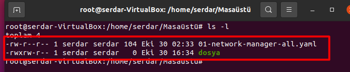

Dosya ve dizin erişim hakkı 3 grupta incelenir;

- **Dosya sahibi**
- **Dosya sahibinin grubu**
- **Diğer kullanıcılar**

Dosya izinleri için bir örnek;

**-rwxrw-r--**   Burada ki kodda şu anlatılmaktadır. İlk harf dosya türünü söyler.

Tire harfi ise dosya , d harfi ise dizindir

- '-' : dosya
- 'd' : dizin

daha sonra gelenler ise 3 ayrı parçaya ayrılır. Burada ki örnekte 3 parçaya ayırırsak;

(rwx) – (rw-) – (r--)

Yani;

- (rwx) -> Dosya sahibi okuma, yazma ve çalıştırma iznine sahiptir
- (rw-) -> Dosya sahibi grubu okuma ve yazma iznine sahiptir.
- (r--) -> Diğer kullanıcılar ise yalnızca okuma iznine sahiptir.

**Peki dosya izinlerini nasıl yönetiriz?**

Dosya ve dizin izinleri yönetmek için **chmod** komutu kullanılmaktadır. **chmod** komutunun aldığı belirli parametreler ile bu izinler düzenlenebilir, çıkarılabilir ve eklenebilir.

2 ayrı kullanım şekli vardır.

1. **Kullanımı**

chmod komutunun aldığı parametrede ki anlamsal ifadeler;

- **u** - dosya sahibi(user)
- **g** - dosya sahibinin grubu(group)
- **o** - diğer kullanıcılar(others)
- **a** - tüm haklar
- **+** - yetki ekle
- **-** - yetki çıkar
- **r** - okuma yetkisi(read)
- **w** - yazma yetkisi(write)
- **x** - çalıştırma yetkisi(execute)

```
chmod o+w <dosyaAdi>            Diğer kullanıcılara yazma yetkisi verir.
```

```
chmod ug+rwx <dosyaAdi>         Dosya sahibi ve grubuna okuma,yazma ve çalıştırma yetkisi verir.
```

```
chmod o-w <dosyaAdi>            Diğer kullanıcıların yazma yetkisini kaldırır
```

```
chmod *+w <dosyaAdi>            Tüm kullanıcılara yazma yetkisi verir
```


2. **Kullanımı**

Chmod da sayısal ifadelerle de yetkilendirme yapabiliriz.

- **4** – okuma yetkisi
- **2** – yazma yetkisi
- **1** – çalıştırma yetkisi
- **0** – yetki kaldırma

**Chmod [dosyaSahibi] [Grubu] [DiğeKullanıcılar] <dosyaAdi.>**

İlk rakam dosya sahibine aittir, ikinci rakam grubuna, üçüncü rakam diğer kullanıcılara aittir.

Örneğin dosya sahibine okuma,yazma çalıştırma yetkisi verelim

Yani o halde 4+2+1 = **7** rakamını vereceğiz.

Grubuna okuma ve yazma yetkisi verelim. 4+2 = **6** vereceğiz

Diğer kullanıcılara da yalnızca okuma yetkisi verelim **4** vereceğiz

O halde **`chmod 764 <dosyaAdi>`** olacaktır.

#

## **2-(chown)Dosya ve Dizin sahibini değiştirmek**
**chown** komutu ile dosya veya dizin sahibini değiştirebiliriz.

**`chown <Kullanici> <dosyaAdi>`**
 ## **3-(chgrp)Dosya ve Dizin grubunu değiştirmek**
chgp komutu ile dosya veya dizin grubunu değiştirebiliriz.

**`chgrp <grup> <dosyaAdi>`**

Örnek olarak dosyamızın grubunu değiştirelim. Önce dosyamızın hangi guruba ve usera ait olduğuna bakalım;


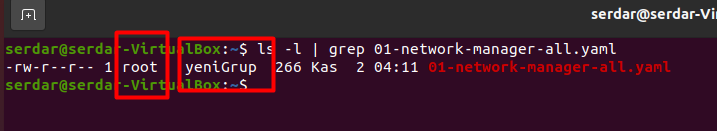

dosyanın **useri root**,     **grubu yeniGrup** olarak görünüyor. Şimdi grubumuzu **testGrup** yapalım;

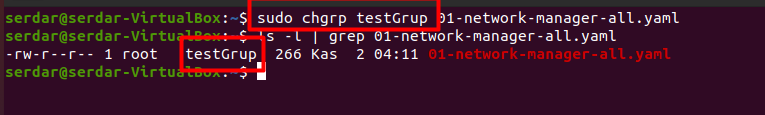

```
chgrp testGrup 01-network-manager-all.yaml
```

Yazdığımız komut ile artık grubumuz **testGrup** adlı gruba geçti.

## **(chattr) Dosya Kilitlemek**

Bu komut bir dosyanın değiştirilme, **silinme** vb. gibi durumların yaşanmasını engellemektedir. Öyle bir komuttur ki **root** kullanıcısı bile dosya üzerinde bir değişiklik veya silme işlemi yapamaz. Hatta daha ileri gidersek **sistemin kendisi bile** dosya üzerinde bir değişiklik veya silme işlemi yapamaz.

Komutumuzun kullanımı **`chattr +i dosyaAdi`** şeklindedir. 

Bu tür kilitli dosyaları listelemek için **`lsattr`** komutunu kullanmaktayız. Şimdi öncelikle;

```
lsattr
```

komutunu kullanarak dosyalarımızı listeleyelim.

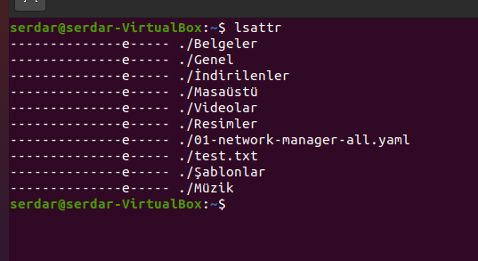

Dosyalarımız bu şekilde görünmektedir. Şimdi ise **test.txt** dosyamızı kilitleyelim

Bunun için ;

```
chattr +i test.txt
```

komutumuzu kullanalım.

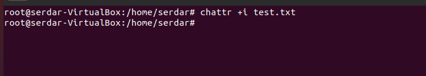


 Şimdi tekrar  **`lsattr`** komutumuz ile dosyalarımızı listeleyelim. Bakalım istediğimiz şekilde **test.txt** dosyamız kilitlenmiş mi?


Dosyamız sistem tarafından kilitlenmiş görünüyor. Şimdi **root olarak silmeyi deneyelim**


**root** kullanıcı ile silmek istesek bile izin vermedi. 

Şimdi **dosyamızın kilidini kaldıralım**

Bunun için **`chattr -i dosyaAdi`** komutunu kullanırız.

```
chattr -i test.txt
```


Böylece dosyamızın kilidini kaldırmış olduk.


# **LINUX DOSYA VE DİZİN KOMUTLARI**
# **1-touch**
Genel olarak dosya oluşturmak için kullanılır. Ancak komutun ana işlevi mevcut dosyaların tarih bilgisini değiştirmektir.

Parametre olarak verilen dosya mevcut değilse oluşturulur. Kullanımı;

```
touch <dosyaAdi>
touch dosya1
```


```
touch -t YYYYAAGGSSDD.SS <dosyaAdi>
```

komutu ile dosya tarihini değiştirebiliriz.


# **2-mkdir**
Klasör oluşturmak için kullanılır. Yeni bir dizin oluşturulabilir.

```
mkdir <dosyaAdi>
mkdir klasor1
```


# **3-mv**
Dosya ve dizin taşımak veya yeniden adlandırmak için kullanılır.

```
mv <kaynak> <hedef>
mv dosya1  serdar/Desktop/
```

Dosya  veya dizin taşır.


```
mv <eski\_isim> <yeni\_isim>
mv dosya1  dosya1Yeni
```

Dosya veya dizin adını değiştirir.


# **4-cp**
```
cp <kaynak> <hedef>
cp dosya1 serdar/Desktop/
```

Dosya kopyalamak için kullanılır.


```
cp -r dizin1/   home/serdar/
```

Dizin kopyalamak için **–r** parametresi almalıdır.


# **5-rm**
```
rm <dosyaAdi>
```

Dosya silmek için kullanılır.


```
rm -f <dosyaAdi>
```

Dosyayı silmeye zorlamak için **–f** parametresi kullanılır


```
rm -r <dizinAdi>
```

Dizin silmek için **–r** parametresi almalıdır.


# **6-cat**
Dosya içeriğini okumak için kullanılır. Ayrıca  dosya içerisine yazmak içinde kullanılabilir.


```
cat <dosyaAdi>  
```

  dosyayı okur.


```
cat -n <dosyaAdi>
```

-n parametresi ile dosya içine yazılabilir. Yazdıktan sonra çıkmak için **ctrl+c**


```
cat > <dosyaAd>
```

 komutu ile eğer dosya varsa içerisine veri yazabiliriz. Sonrasında **ctrl+d** tuşu ile çıkarız. Ancak **dosyamızda daha önce veri varsa o veriyi silip yeni veriyi ekleyecektir** . Eğer dosya yoksa yeni dosya oluşturup bu işlemi gerçekleştirecektir.


```
cat >> <dosyaAdi>
```

komutunu kullanırsak dosyanın içerisinde ki eski veriyi silmez yalnızca yazdıklarımızı dosyaya ekler.


# **7-head**
Dosya içeriğini dosya başından itibaren okumak için kullanılır. Varsayılan olarak ilk 10 satırı okur. Satır sayısı belirtmek için -n parametresi kullanılır

```
head <dosyaAdi>
head -n20 <dosyaAdi>
```


# **8- tail**
Dosya içeriğini sonundan itibaren okumak için kullanılır. Varsayılan olarak ilk 10 satırı okur. Satır sayısı belirtmek için -n parametresi kullanılır

```
tail <dosyaAdi>`
tail -n15 <dosyaAdi>
```


# **9-more**
Dosya içeriğini parça parça okumak için kullanılır. Sayfaları ilerlemek için **space**, komuttan çıkmak için **q** tuşu kullanılır

```
more <dosyaAdi>
```


# **10-less**
Dosya içeriğini **more** komutundan daha fazla seçenekle parça parça okumak için kullanılır. Yukarı aşşağı tuşu ile sıralı okunabilir.

```
less <dosyaAdi>
```


# **11-nl**
Dosya içeriğini satır numarası ekleyerek okuma yapar.

```
nl <dosyaAdi>
```


# **12-pr**
Dosya içeriğini sayfalayarak okumak için kullanılır.

```
pr <dosyaAdi>
```


# **13-file**
Dosya ile ilgili bilgi almak için kullanılır.

```
file <dosyaAdi>
```


# **14-stat**
Dosya ile ilgili detaylı bilgi almak için kullanılır.

```
stat <dosyaAdi>
```


## 15-shred

Bu komut ile Dosya içerisine rastgele bitler yazmakta ve dosyanın okunmaz hale gelmesini sağlamaktadır. Kullanımı;

```
shred <dosyaAdi>
```

Ayrıca


# **LINUX ARAMA KOMUTLARI**
## **1-grep**
Dosya içerisinde harf veya kelimeyi arar. Dosya içerisinde arama yapar.
**`grep <aranacakKelime> <dosyaAdi>`**

**-v parametresi ile dosya içinde bulunmayan kelimeleri getirir.**
**`grep –v  <aranmayacakKelime> <dosyaAdi>`**

**-i parametresi ile büyük-küçük harf duyarlılığını kaldırır.**
**`grep –i  <aranacakKelime> <dosyaAdi>`**

**-r parametresi aramayı dizin altında ki tüm dosya ve dizinlerde yapar.**
**`grep –r  <aranacakKelime> <dizinAdi>`**

**-ir parametresi arama sırasında başlangıç (^) ve bitiş ($) karakterleri ile arama yapılabilir.**

**`grep -ir <^aranacakKelime> <dosyaAdi>`** 

**`grep -ir ‘Ka’ dosya1`**

## **2-find**
Geniş bir kullanımı olan arama komutudur.

-name ve -type opsiyonu genel olarak kullanılır

-type d = dizi   -type f =dosya

-type belirtmezsek o isme sahip dosya ve dizinleri listeler.

**`find <aramaYapilacakDizin> <opsiyon –name/-type> <aranacakOrgu>`**

**`find / -name “Error.log”`**

**`find / -type d  -name “dizinSerdar”`**

Belirli bir uzantıya ait dosyaları aramak için <\*.txt>  gibi kullanılabilir.

Aranacak dosya veya dizin adı tam olarak bilinmiyorsa <aran\*> gibi kullanılabilir.

Boş dosya veya dizinleri bulmak için sonuna  **-empty** parametresi kullanılır. 

**`find <arama\_yeri> -name <aranan> -empty`** gibi

Bulunan ifadeler için komut çalıştırmak için **exec** parametresi kullanılır.

Örneğin rm komutu ile bulunanı sileceğiz..

**`find<aramaYapilacakDizin>  -name <aranacak> -exec rm -r {} \;`**

Boyuta göre KB cinsinden arama yapması için;

**`find  /etc  -size 500`**

**Sunucuda tüm .log dosyaları bulmak istersek, \* işaretini kullanırız**

**`find / -name “\*.log”`**
## **3- Locate**
Locate komutu find komutu gibi dosya adı ile arama yapmamızı sağlar ancak find komutundan çok daha hızlıdır. Çünkü find taramaları gerçek zamanlı yaparken **locate dosyayı daha önce katoglanmış veritabanından tarar.**

Locate komutu **var/lib/mlocate/mlocate.db** isimli veritabanını kullanmaktadır.

Locate komutunu kullanmadan önce **updatedb** komutunu çalıştırmalıyız. Sebebi ise mlocatedb veritabanını **updatedb** komutu oluşturur ve günceller. Veritabanının güncel kalması için sorgulama sırasında çalıştırılması gerekir.

Ancak updatedb komutunu root kullanıcısı veya sudo olarak çalıştırmamız gerekmektedir.

Bunun için root olarak giriş yapmalı veya sudo ile;

**`sudo updatedb`** Komutunu kullanmalıyız.

Eğer terminalde komut tanınmaz ise sistem tarafından ön yüklü değildir. Bunun **için mlocate paketini** kurmalıyız. 

Linux dağıtımı olan Ubuntu için :  `sudo apt install mlocate` 

Böylece mlocate paketini kurmuş olacağız. Ardından updatedb komutunu kullanıp veritabanımızı güncelledik. Artık **locate** komutunu kullanabiliriz.

**`locate <dosyaAdi>`**

**`Locate dosyaAdi`**

Eğer küçük-büyük harf duyarlılığını istemiyorsak **-i** parametresini kullanabiliriz.

**`locate -i DOSYaADi`**
## **4-whereis ve which**

# **LINUX SIKIŞTIRMA İŞLEMLERİ**

Linux dağıtımlarında arşivleme veya yedekleme işlemleri için gzip, bzip2, lzma vb. yöntemler ve komutları mevcuttur.

## 1-tar


Arşivleme ve dosyaları bir formatta tutmak için **tar** komutunu kullanırız.  işlemler **tar** komutuna çeşitli parametreler verilerek yapılır.

Komutun alabileceği parametrelerden bazıları;

**c** - arşiv oluşturmak için,

**f** - dosyaya yazdırmak için,(gerekli parametre) (hangi dosyaya yazılıacağı)

**t** - arşivdeki dosyaları listelemek için,

**v** - komut çıktılarını ekrana yazdırmak için,

**x** - arşiv dosyasını çıkarmak için,

**z** - arşiv yöntemi olarak gzip kullanmak için,

**p** - arşivdeki dosya ve dizin izinlerini de eklemek için,

**j** - arşiv yöntemi olarak bzip2 kullanmak için

**r**- var olan arşive yeni dosya ekler.

**`tar <parametre> <arsivinAdi.uzantisi>  <sıkıstırlacakDosyalar>`**

**`tar  -cf   dosyalar.tar   dosya1  dosya2`**

**`tar  -xf   dosyalar.tar   -C  /home/serdar/`   tüm dosyaları istenilen dizine çıkarır**

**`tar  -xf   dosyalar.tar    dosya1  -C /home/serdar/` yalnızca dosya1 i çıkarır**

**`tar  -rf   dosyalar.tar    dosya3`   var olan arşive dosya3 ü ekler**

**`tar  -tf   dosyalar.tar`      arşiv içindeki dosyaları listeler**

**Sadece belirli dosya uzantısına ait dosyaları arşivden çıkarmak istersek –wildcards kullanılabilir.**

**`tar  -xf  dosyalar.tar –wildcards   ‘\*.jpg’`**

## 2-gzip-bzip2

**tar** komutu ile dosyalarımızı arşivledik. Şimdi ise **dosya sıkıştırma işlemlerini yapalım**

Sıkıştırma işlemi için iki temel aracımız var. Bunlar **`gzip`** ve **`bzip2`** dir.

Öncelikle birkaç normal dosyayı **sıkıştıralım**

```
gzip dosyaAdi
```

```
bzip2 dosyaAdi
```


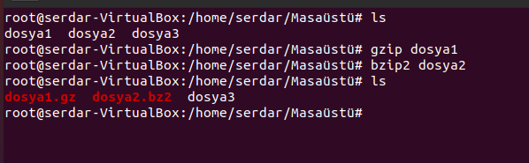


**`gizp dosya1`** komutu ile dosya1'i `gzip` yöntemiyle sıkıştırdık.

**`bzip2 dosya2`** komutu ile dosya1'i `bzip2` yöntemiyle sıkıştırdık.

Peki sıkıştırmış olduğumuz dosyaları geri nasıl çıkartabiliriz?

Çok basit yalnızca komuta **`-d`** parametresini koymamız yeterli olacaktır. Ancak küçük bir fark var. **`bzip2`** dosyasını çıkarmak için dosyanın uzantısını yazmalıyız. Yani ==> **`bzip2 -d dosya2.bz2`** gibi.

Bu gzip için geçerli değildir. Ancak yine de önerim dosya uzantısını da eklemeniz.

Yani sıkıştırmış olduğumuz dosyaları geri çıkarmak için;

```
gzip -d dosya1.gz
```

```
bzip2 -d dosya2.bz2
```

Deneyelim;

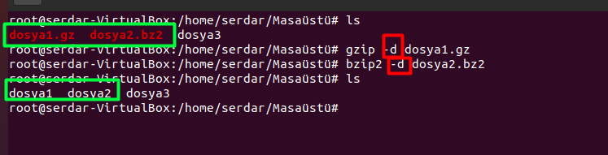

Şimdi **ÖNEMLİ OLAN KISIMA GELDİK** **`tar`** komutu ile `gzip` ve `bzip2` sıkıştırma işlemini yapacağız. Yani;

**TAR ARŞİV DOSYASINI GZİP VEYA BZİP2 İLE SIKIŞTIRACAĞIZ** . Bunu konu başlığı olarak açıklamak isterim.

## 3-tar Arşiv Dosyasını gzip Veya bzip2 Ile Arşivlemek

Bu işlem için İki farklı yolumuz mevcuttur.

Öncelikle basite indirgenmiş ancak dolaylı yolu göstermek isterim. 

### Dolaylı Yoldan Arşiv(tar) Dosyasını Sıkıştırmak

1- Öncelikle dosyalarımızı **tar** komutu kullanarak arşivleyelim.

```
tar -cf dosyalar.tar dosya1 dosya2 dosya3
```

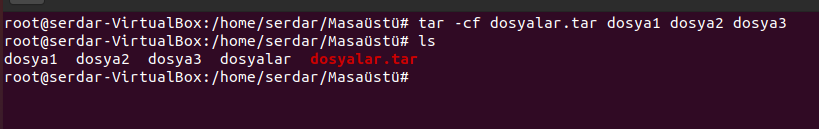

Dosyalarımızı artık **`dosyalar.tar`** arşivine attık.

Şimdi bu arşiv dosyamızı `gzip` veya `bzip2` ile sıkıştırabiliriz.


2-Arşiv dosyasınız **gzip** veya **bzip2** ile sıkıştıralım ve daha sonra tekrar çıkaralım

```
gzip dosyalar.tar
```

```
gzip -d dosyalar.tar.gz
```

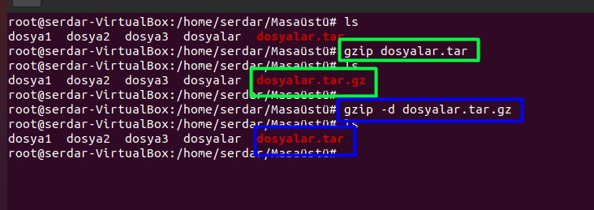

Bu şekilde **tar** dosyamızı sıkıştırıp daha sonra tekrar çıkarttık.

### tar Komutuyla Dosyaları Arşivleyip Sıkıştırmak

`gzip` ve `bzip2` araçlarını **tar** komutu yardımıyla arşivleme işlemi yapacağız. Ancak bu işlemi yaparken küçük farklılıklar var.

Bu fark şöyledir

`gzip` ile **tar** komutuyla arşivleme ve sıkıştırma yaparken;

```
tar -czf dosyalar.tar.gz dosyaAdi
```

`bzip2` ile **tar** komutuyla arşivleme ve sıkıştırma yaparken;

```
bzip2 -cjf dosyalar.tar.bz2 dosyaAdi
```

parametrelerini kullanmaktayız. Şimdi birlikte bu örneği **gzip** için uygulayalım.

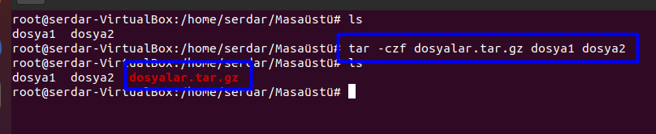

Böylelikle **tar** komutu ile **gzip** işlemini yapmış olduk.


Şimdi de bu örneği **bzip2** için uygulayalım.

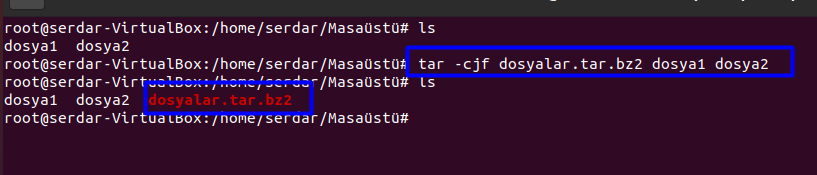

Böylelikle **tar** komutu ile **bzip2** işlemini yapmış olduk.

Eğer dosyalarımızı sıkıştırmış olduğumuz `gzip` ve `bzip2` den çıkartmak istersek, `-c` parametresi yerine `-x` parametresini kullanıyoruz.  İsterseniz çıkartma işlemi yaparken bu dosyaları aynı zamanda farklı bir dizine gönderelim. Yani;

 

```
tar -xzf dosyalar.tar.gz -C dosyalarim/
```

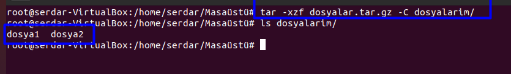


```
tar -xjf dosyalar.tar.bz2 -C dosyalarim/
```


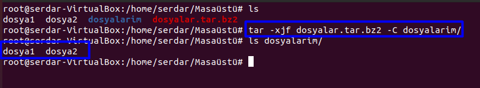


Böylece **tar** komutuyla sıkıştırmış olduğumuz arşivimizin içerisinde ki dosya1 ve dosya2 yi dosyalarim/ dizini içerisine çıkarmış olduk.

## 4-zcat-zgrep-bzcat-bzgrep

Bildiğimiz gibi `cat` komutu ile okuma `grep` komutu ile arama yapıyoruz. Şimdi göreceğimiz komutlar ise adından da anlaşıldığı üzere **sıkıştırılmış dosyalar için aynı görevi üstlenmektedir.**


Durumu daha iyi anlayabilmek adına **sıkıştırılmış dosyamızı** öncelikle `cat` ile okumaya, daha sonra `zcat` ile okuyalım.

Sıkıştırılmış dosyayı `cat` komutu ile okumaya çalışıyoruz;


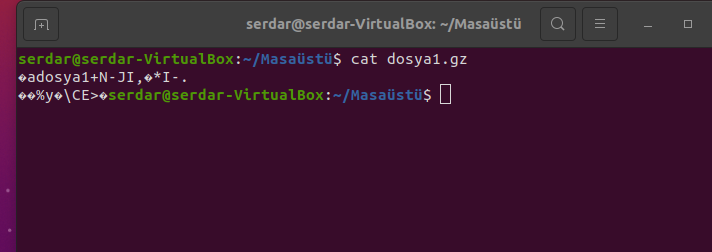


Okuyamadığımız anlamsız kelimeler görüyoruz. Şimdi ise bu işlemi  gzip için`zcat` ile yapalım

```
zcat dosya.gz
```

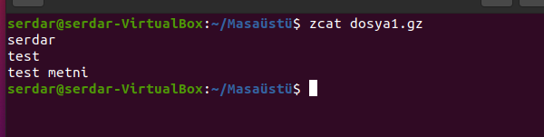

Dosyamızın içeriğini gayet doğru bir şekilde okuyabiliyoruz.

`bzip` dosyası içinse `bzcat` komutu kullanırız.

```
bzcat dosya2.bz2
```

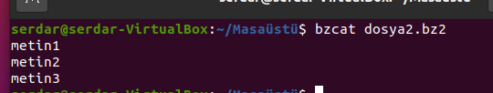

**zgrep ve bzgrep** içinde aynı şeyler geçerlidir;

```
bzgrep metin dosya2.bz2
zgrep test dosya1.gz
```

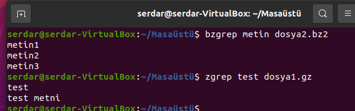

## 5-zip-unzip

`.zip` uzantılı dosyalar **oluşturmayı** ve **açmayı** görelim. 

`.zip` uzantılı dosya oluşturmak için;

```
zip <zipdosyaAdi.zip> <dosya>
```

komutunu kullanırız. Şimdi örnek olarak bir tane yapalım.

```
zip dosyam.zip belge.txt
```

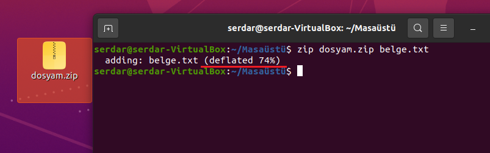

Dosyamızı `.zip`formatı ile sıkıştırdık ve %74 oranında bir sıkıştırma işlemi sağlanmış.

Şimdi  ise dosyamızı geri çıkaralım. Bunun için;

```
unzip <zipdosyaAdi.zip>
```

komutunu kullanırız. Şimdi örnek olarak dosyamızı `.zip`ten çıkaralım.


**NOT:** Eğer birden çok dosya ziplenmiş ve sadece 1 dosyayı zipten çıkarmak istiyorsak; `unzip <zipDosyasiAdi> <dosyaAdi>` olarak kullanılabilr.

## 6-Gördüğümüz Sıkıştırma Araçlarının Sıkıştırma Oranları

Bir dosya oluşturduk ve gördüğümüz tüm işlemleri bu dosyamıza uyguladık. Şimdi bakalım **hangi formatımız ne kadar sıkıştırma işlemi yapmış**

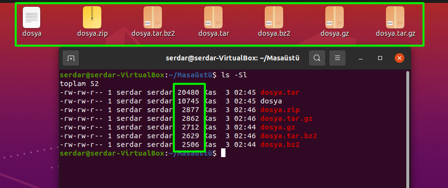

Yeşil renk ile belirtilen alan dosya boyutudur. **BOYUTLAR BYTE CİNSİNDEN GÖSTERİLMEKTEDİR**

En yüksek boyut `tar` olarak görünmektedir. Ancak bildiğimiz üzere `tar` bir çeşit arşivleme, dosyaları bir formata sokma ortamını sağlamaktadır.

En düşük boyut ise `bz2` olarak görünüyor.


# **LINUX METİN DÜZENLEYİCİLER**

## **1-nano metin editörü**
Nano metin düzenleyicisi sistemde yüklü olmayabilir. Yüklü olup olmadığını

**`nano –version`** komutu ile öğrenebiliriz. 

Eğer nano metin düzenleyicisi yüklü değilse

Linux dağıtmı Ubuntu için : sudo apt-get install nano ile paketi kurabiliriz.

Nano ile bir dosya açmak için ;

**`nano <dosyaAdi>`** komutunu kullanmalıyız. Açılacak dosya ile aynı dizinde olmamız gerekmektedir.

Eğer dosya adı belirtmeden, yalnızca **nano** komutu kullanılırsa dosyayı yazdıktan sonra istediğimiz dosya adını verip ait olduğumuz dizinde oluşturabiliriz.
## **2-vi metin editörü**
Nanoya göre daha güçlü bir editördür ancak kullanımı daha zordur. Örneğin bir sistem çöktüğü zaman dosyaları nano ile açmak pek mümkün olmayabilir. **Kernel seviyesinde** işimize yarayacak sadece **vi** metin editörüdür. Sebebi ise **linux vi editör ile yazılmıştır**.

Vi editörü çalışma esnasında üç ayrı mod ile gelir. 

Birincisi bilgisayara komutların girdisi sırasında kullanılan vi modu,

İkincisi yazı yazarken kullanılan input modudur.

Üçüncüsü command modudur.

Komut modunda klavye üzerinde görevi olan tüm tuşlar, bilgisayar komut vermek için kullanılıyor. Yazı modunda ise diğer editörlerdekine benzer şekilde yazı yazmak mümkün olmaktadır. Klavye modu değiştirildiğinde klavye tuşlarının işlevleri de hemen değişmektedir. Vi editörünü ilk çalıştırdığınız anda komut moduna girilmektedir.

1. Menü(Menu)
1. Metin(Text) -> input modu.

İlk ekran Menü modu ile açılır. Daha sonra yazı moduna  ESC+i, a ve o ile geçilebilir.

**İ** = insert

**a** = append

**o** = open

Silme, geriye alma, aşağı satıra geçmek için tekrar yazı modundan **ESC ile Menü moduna geçilir.**

**Menü** modunda;

**a -> ile sağ tarafa bir karakter ilerler**

**o -> ile alt satıra geçilir**

**x -> ile silme işlemi yapılır**

**5+x -> ile 5 karakter soldan sağa doğru siler**

**dd -> ile  ilgili satırı siler**

**5+dd -> ile yukarıdan aşağıya 5 adet satır siler**

**u -> bir defaya mahsus geri getirir**

Menü modunda satırlar arası yön tuşları ile gezilebilir ancak kernel seviyesinde yapabilmek için; 

**Menü modunda “k” tuşu ile yukarı;**

**Menü modunda “j” tuşu ile aşağı;**

**Menü modunda “h” tuşu ile sola**

**Menü modunda “l” tuşu ile sağa**

Kelimeler de arama yapmak için;

**/ yani -> shift+7** tuşuna basmalıyız.

command kipine ise vi modundayken “:” ile girilir. İstisna olarak arama yapmak içinde “/” ile girilir.

Bir kelimeyi replace etmek için

**`:%s/EskiKelime/YeniKelime/g` NOT: BÜTÜN AYNI ISME SAHIP KELİMELERİ REPLACE ETMEKTEDİR.**

Bir metnin üst satırına yeni bir satır açıp yazı yazmak istersek;

**Shift+o** tuşunu kullanmalıyız

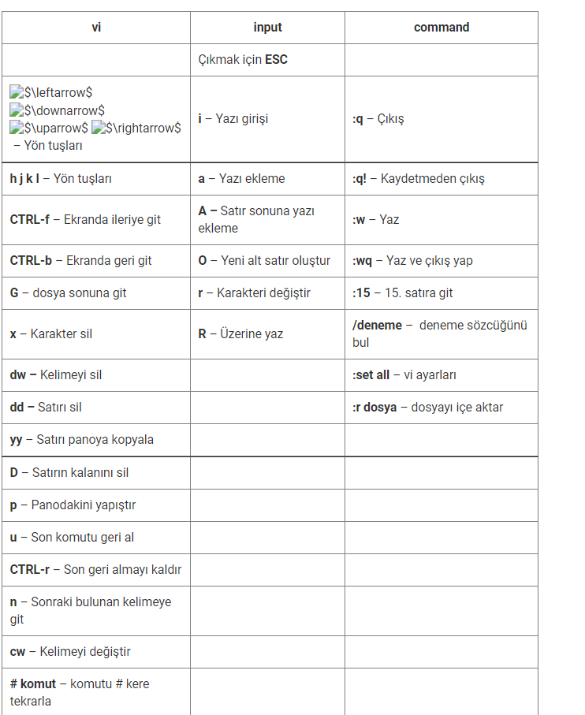


# LINUX KULLANICI  İŞLEMLERİ

## 1-Kullanıcı Ekleme

Kullanıcı eklemenin 2 ayrı seçeneği ve komutu vardır;

- **useradd Komutu**
- **adduser Komutu**


#### 1-adduser komutu

Yeni bir kullanıcı eklemek istiyorsak **`adduser <kullaniciAdi>`**  komutunu kullanmalıyız. Bu komut ile beraber sistem yeni bir kullanıcı oluşturup, o kullanıcıya ait bir ev dizinini otomatik oluşturacaktır. Örnek olarak bir kullanıcı ekleme işlemi yapalım.

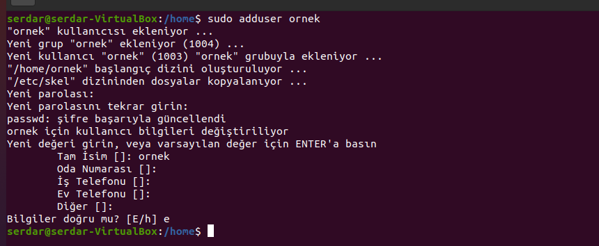

Böylece ornekkullanıcısı oluşturulmuş ve ornek grubuna dahil edildi. Yapılan işlemleri teyit etmek amaçlı, sistemde kullanıcı hesaplarının tutulduğu **`/etc/passwd`** dosyasına göz atabiliriz.

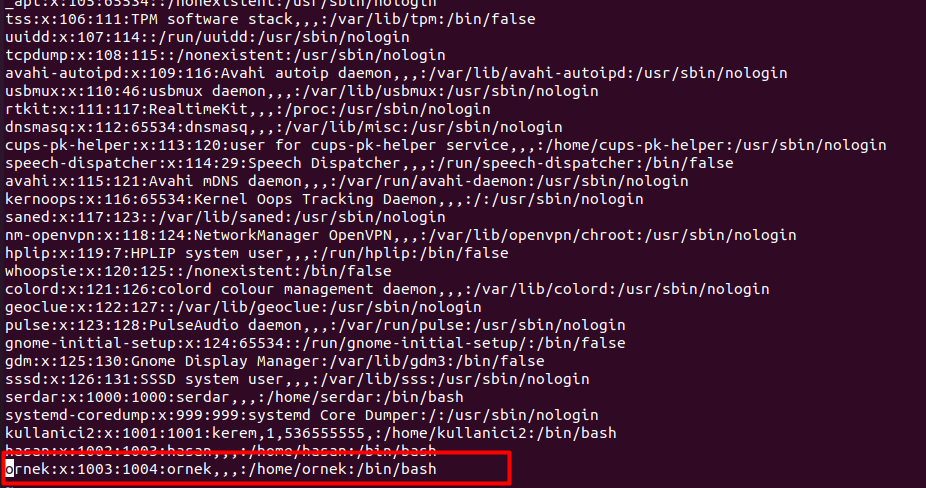

Dosya içerisinde ornek kullanıcısının eklenmiş olduğunu görmüş olduk.

**`/etc/group`** dosyasını da incelediğimizde kullanıcımızın kaydedildiği yerleri görebiliriz.

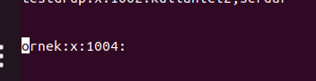

Aynı zamanda **`adduser`** komutunun kullanıcıya ait ev dizini oluşturduğunu da söylemiştik. Bunu da kontrol edecek olursak;

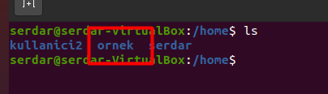


#### 2-useradd komutu

useradd komutu nasıl çalıştırıldığına gelmeden önce birkaç bilgi vermek isterim. Useradd komutu kullanıcı ekleme işlemleri için **`adduser`** komutuna nazaran daha düşük seviyelidir. **`useradd`** komutu ile yalnızca kullanıcıyı oluştururuz. Ev dizinine ekleme, şifre oluşturma vb. işlemleri farklı parametre ve komutlarla sağlamalıyız.


Kullanıcı oluşturma işlemi için  **`useradd <kullaniciAdi>`** komutunu yazmalıyız **ancak** bu işlemi yaparken kullanıcıya ait **home** dizini de oluşturmak istiyorsak **`-m`** parametresini kullanmamız gerekmektedir. 

```
useradd -m <kullaniciAdi>
```

Örnek olarak bir kullanıcı ekleyelim;

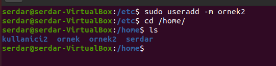

Böylece "ornek2" kullanıcımızı sisteme eklemiş olduk. 

Kullanıcımızı oluşturtan sonra ona ait bir şifre oluşturmak için **`passwd`** komutunu kullanmalıyız. Şimdi ornek2 kullanıcımız için bir şifre belirleyelim;

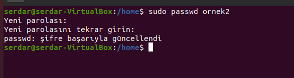

Böylece ornek2 kullanıcımızın artık bir şifresi oldu.

Grup oluşturma ve kullanıcıları görme konusu daha sonra ancak değinmişken kullanıcıyı gruba ekleme işlemi sağlayalım. 

Bir kullanıcıyı gruba eklemek için;

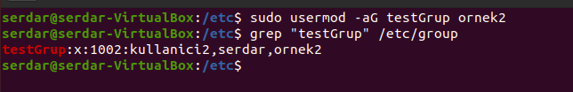

Şimdi kullanıcımız gruba gerçekten eklenmiş mi görelim;

**grep**  ile arama yapabilir veya direkt olarak **`/etc/group`** dosyasına girip inceleyebiliriz.

Böylece istediğimiz işlemi sağladık.


## 2-Kullanıcı Arama Ve Listeleme

Eğer Linux kullanıcılarını listelemek istiyorsak ilk başvuracağımız yer **`/etc/passwd`** dosyası olacaktır.

Dosya içerisinden veya dosya içerisinde arama yaparak(**grep komudu**) kullanıcılarımızı görebiliriz.

Linux kullanıcısının var olup olmadığını görebilmek için;

```
id <userName>
```

komutunu kullanmalıyız. Bize çıktı olarak ya böyle bir kullanıcı olmadığını ya da kullanıcnın ait olduğu gruplara dair bilgiler verecektir.

Kullanıcının ait olduğu gruba dair vereceği bilgiden önce **grup sistemi ne olduğu**, hakkında bilgi vermek isterim.  Daha sonrasında bu işlemi grup sistemi konusu içerisinde yapalım.

## 3-Kullanıcı Silme

Bir kullanıcıyı  **`deluser`** komutunu kullanırız.

 Ev diziniyle beraber kullanıcıyı silmek istiyorsak;

```
deluser --remove-home <kullaniciAdi>
```

komutunu kullanırız. **`man deluser`** ile aldığı parametreleri görebilirsiniz.

Kullanıcının silindiğinden emin olmak için **`/home`** dizinine `ls` ile bakarak,

**`/etc/group`** ve **`/etc/passwd`** dosyalarından sorgulayabiliriz.


## 4-Kullanıcı Hesabını Aktif-Pasif Hale Getirmek


- #### **Kullanıcıyı Pasif Hale Getirmek**

Sistemde kayıtlı olan bir kullanıcıyı kilitleyebiliriz ve böylece kullanıcı sisteme giremeyecektir.

Bir kullanıcının hesabını kilitlemek için **`usermod`** komutunun **`-L`** parametresini kullanırız.

```
usermod -L <kullaniciAdi>
```

komutunu kullanırız.

Peki bu komutu girdiğimiz zaman sistemde nasıl bir işlem yapılır. Bildiğimiz üzere **Linux'ta her şey dosyadır.**

Sistemde kullanıcı hesaplarının parolaları **/etc/shadow** dosyası içerisindedir. Bu parolalar dosya içerisinde şifreli olarak gösterilir.

Biz **`usermod -L <kullaniciAdi>`** komutunu yazdığımız zaman sistem **`/etc/shadow`** dosyası içerisinde **kullanıcıya ait şifreli **parolasının önüne **`!`** işareti koyacaktır ve böylece **kullanıcı şifresi ile sisteme giriş yapamayacaktır.**

Sistemde **kullanici2** isimli kullanıcıyı kilitleyelim **ama öncesinde** bahsettiğimiz **shadow** dosyasına bakalım.

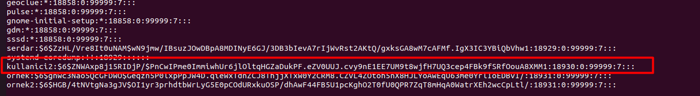

Gördüğümüz üzere **kullanici2** nin parolası şifreli bir şekilde görünüyor. Ancak **önünde `!` simgesi yok**. Yani şuan kullanıcımızı kilitlemedik. Şimdi kullanıcımızı kilitleyelim.


Kullanıcımızı kilitledik. Şimdi gerçekten kilitlenmiş mi diye **shadow** dosyamıza bakalım ve **!** işareti var mı kontrol edelim.

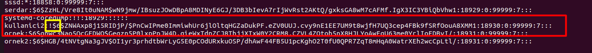

Evet yazdığımız komut sayesinde **kullanici2** yi kilitledik ve artık sisteme giriş yapamayacaktır.

- #### **Kullanıcıyı Aktif Hale Getirmek**

  Kullanıcımızın kilidini açmak ve aktif hale getirmek için **`usermod`** komutunun **`-U`** parametresini kullanırız.

  ```
  usermod -U <kullaniciAdi>
  ```

  Şimdi kilitli olan **kullanici2** adlı kullanıcımızın kilidini kaldıralım.

  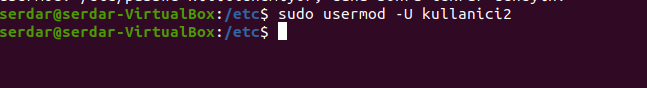

  **shadow** dosyasında ki **!** işareti kalkacaktır ve kullanıcımız artık giriş yapabilir.


## 5-Kullanicilar Arasi Kimlik Degisimi

Sisteme yeni kullanıcı ekleme ve birden çok kullanıcının sistemde olabileceğini biliyoruz. Peki **kullanıcılar arası değişim** nasıl yapabiliriz?

Örneğin ben **serdar** kullanıcısıyla aktifim ve bir işlem yapmam gerekiyor ancak yetki alanımda değil ve **parolasını bildiğim** bir kullanıcının buna yetkisi var. Böyle bir durumda o kullanıcının kimliğine bürünerek gerekli işlemleri gerçekleştirebilir ve geri çıkabilirim.

Peki bunu nasıl yaparız. Bu işlem içi **`su`** komutunu kullanırız. Ancak bu komutun 2 farklı durumu mevcuttur.

**`su <kullaniciAdi>`** olarak işlemimizi gerçekleştirirsek, diğer kullanıcının kimliğine geçeriz.

**`su - <kullaniciAdi>`** olarak işlemimizi gerçekleştirirsek, diğer kullanıcının kimliğine geçer ve **kullanıcının KABUĞUNDA** çalışmaya başlar. 

Buradaki **detay** çok önemlidir. Bunu iyi anlayabilmek adına **normal kullanıcı** ve **root** kullanıcı arasında kimlik değişimleri yapalım.

**root**  adlı kullanıcıdan kimlik değişimi yaparak **serdar**  kullanıcısına geçelim.

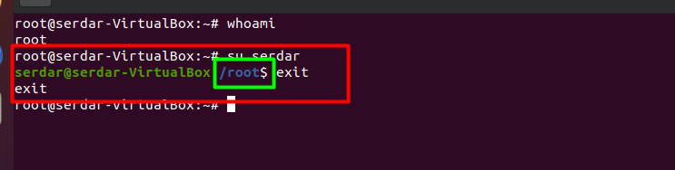

**`su serdar`** komutu ile **serdar** kullanıcısına geçtik. Konsol ismine ve **/root** kısmına dikkat edelim lütfen.

**ŞİMDİ `su - serdar` YAZARAK GEÇİŞ YAPALIM**


Gördüğünüz üzere **`su serdar`** komutu kullanarak geçiş yaptığımızda konsolda **`serdar@serdar-VirtualBox:/root$`** yazıyordu.

Ancak **`su - serdar`** komutu kullanarak geçiş yaptığımızda konsolda **`serdar@serdar-VirtualBox:~$`**  yazdı.

Yani **`su -serdar`** komutunu kullandığımızda geçiş yaptığımız **hesabın kabuğunda çalışmaya başladı** ve tıpkı o hesapta oturum açmışız gibi bir tepkiyle karşılaştık.

#### 

# LINUX GRUP İŞLEMLERİ


## 1-Grup Yönetimi Nedir Ve Faydaları

Linux'ta birçok kullanıcı hesabının var olduğu ve bu kullanıcılar arasında en yetkili kullanıcının **root** kullanıcısı olduğunu biliyoruz.

Ancak Linux sisteminde root kullanıcısı olmadan da root kullanıcısına dair yetkilere sahip olmamız mümkün. **Peki bunu nasıl yapıyoruz?**

Grup yönetimi sayesinde aynı grupta yer alan kullanıcılar aynı haklara sahip olmaktadırlar. Yani kullanıcıları belirli gruplara bölebilir ve gruplara da belli başlı yetkiler verebiliriz.

**Peki Linux'ta grup sisteminin faydaları nelerdir?**

Bunlardan en önemlisi kullanıcı yönetiminde oldukça fayda sağlaması. Grup üyeliği sistemi sayesinde yalnızca izin verilen dosya, dizin vs. erişim hakkı sağlamaktadır.

**Kısaca Grup sistemi bir çeşit yönetim ve kontrol mekanizmasıdır.**

Bir grup oluşturduğumuzda grubun bilgisi çokça duyduğumuz **`etc/group` dosyası içerisine eklenmekte ve kaydı tutulmaktadır.

Yani sistem üzerinde mevcut grupları görmek istersek doğal olarak **group** dosyasına bakmalıyız.

Hadi birlikte **group** dosyasına girerek hangi gruplarımızın olduğunu ve bu gruba ait hangi kullanıcıların olduğunu görelim.

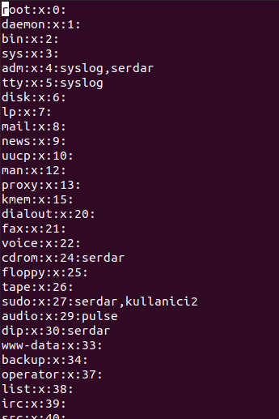

Dosya içerisine girerseniz çok fazla grup olduğu ve bunların **kafa karıştırıcı geldiğini** düşünebilirsiniz ancak **sistem çok basit.**

Örnek birkaç tane grup seçelim ve bu karmaşık kelime ve harflerin **hangi mantıkla** verildiğini görelim.


Örneğin **sudo grubunu** ele alalım. 

**sudo: x :27:serdar,kullanici2**

Resimde belirtmiş olduğum numaraların açıklaması şöyledir;

**1.Grup ismi:** Gruba verilen isimdir. Yani grubumuzun ismi **sudo**

**2-Parola:** Grubun parolasıdır. Eğer grubun parolası yoksa **x** işareti ile gösterilir. Genel olarak gruplarda parola kısmı boştur ancak ayrıcalı gruplarda uygulanmaktadır.

**3-Grup Kimliği:** Gruba atanan kimlik numarasıdır.

**4-Grup Listesi:** Grupta yer alan kullanıcıları göstermektedir. "serdar" ve "kullanici2" **sudo grubunda** yer alıyor.

Ayrıca sudo grubuna kayıtlı kullanıcılar **sudo** komutunu parolası ile birlikte kullanabilmektedir.

Şimdi önceki konuda da bahsettiğimiz **`id <kullaniciAdi>`** komutu olan **kullanıcı gruplarını sorgulama** kısmına gelelim.

## 2-Yeni Grup oluşturma

Şimdi ise yeni bir grup oluşturup, **group** dosyası içerisinde ki kaydını görelim.

Sistemde yeni bir grup oluşturmak için;

```
groupadd <grupAdi>
```

komutunu kullanırız. Şimdi yeni bir grup oluşturalım.

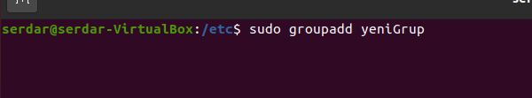

Grubumuzu oluşturduk. Peki grubumuz gerçekten oluşturulup **group dosyasına** kaydı yapıldı mı? Birlikte bakalım.

**group** dosyasından inceleyeceğimiz için küçük bir sorgu ile grubumuzun kaydını görebiliriz.

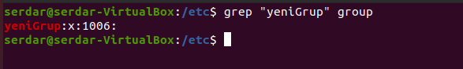

Evet grubumuz **group** dosyası içerisinde bulunuyor. Bir şifresi yok ve kimlik numarası 1006. İçerisinde ise herhangi bir üye yok.

Eğer gruba kendiniz bir kimlik numarası vermek isterseniz; **-g** parametresini kullanabilirsiniz;

```
groupadd -g 7890 <grupAdi>
```

gibi. Eğer aynı id ye sahip başka bir grup varsa hata verecek ve grubunuz oluşmayacaktır. Yani numarayı verirken herhangi bir tereddüt yaşamanıza gerek yok.

## 3-Gruba Yeni Kullanıcı Ekleme

Gruba yeni bir kullanıcı eklemek için;

```
gpasswd -a <kullaniciAdi> <grupAdi> 
```

komutunu kullanabiliriz.  Şimdi yeni oluşturmuş olduğumuz gruba kullanıcımızı ekleyelim.


Grubumuza "serdar" kullanıcısını ekledik ve kontrolünü gerçekleştirdik. Artık oluşturmuş olduğumuz grubun yeni bir üyesi var :)

## 4-Kullanıcı Gruplarını Sorgulama

Grup sistemini ve gruba yeni kullanıcı eklemeyi öğrenmiş olduk. Şimdi sistemde kayıtlı olan kullanıcıların hangi grupların üyesi olduğunu görelim.

Kullanıcının numarası ve hangi grupların aile ferdi olduğunu öğrenebilmek için;

```
id <kullaniciAdi>
```

komutunu kullanıyoruz. Şimdi "serdar" kullanıcımız hangi gruplara üyeymiş görelim.

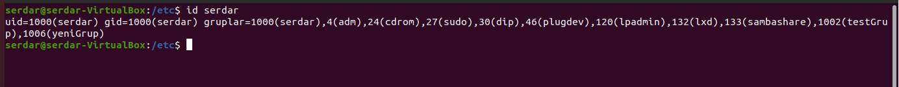

Evet "serdar" kullanıcımız birçok gruba üye olduğunu görüyoruz. Öncelikle her grubumuzun bir **kimlik numarası** olduğunu biliyorduk. Ayrıca kullanıcıların da kendine ait bir **kimlik numarası** vardır. Bunu bir **TC kimlik numarası** gibi düşünebiliriz.

En başta gördüğümüz **`uid`** ve **`gid`** ne olduğunu açıklayalım.

**`uid`** --> **USER ID**  anlamına gelir. Yani kullanıcı numarası.

**`gid`**--> **GROUP ID** anlamına gelir. Yani grup numarası.

Mesela **`24 id li cdrom grubu`**   , **`27 id li sudo grubu`** gibi.

**"serdar"** kullanıcımızın **kullanıcı numarası(UID)=1000** miş.

**Peki kullanıcı numaraları yani UID neye göre verilmektedir??**

ID numaraları üçe ayrılır;

**Root Kullanıcısı:** ID(Kimlik numarası) **0** dır.

**Sistem Kullanıcısı:** ID(Kimlik numarası) **1-499** arası olur.

**Normal Kullanıcı:** ID(Kimlik numarası) 500-N olarak gider.

Böylece Kullanıcının **ne kullanıcısı** olduğunu anlayabiliriz.

## 5-Kullanıcıyı Gruptan Çıkarmak

Eğer grup üyesi olan bir kullanıcıyı gruptan çıkarmak istersek **`gpasswd`** komutunun **`-d`** parametresini kullanırız.

Şimdi **serdar** kullanıcısını  eklemiş olduğumuz **yeniGrup** adlı gruptan çıkaralım.

```
sudo gspasswd -d <kullaniciAdi> <GrupAdi>
```

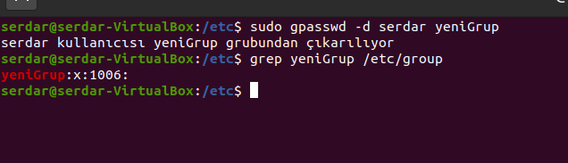

Böylece grubumuzdan **serdar** kullanıcısını çıkarmış olduk.


# LINUX SÜREÇ YÖNETİMİ

Sistemimizde çalışan her program bir süreçten oluşmaktadır. Bu süreç sistemin kaynaklarını kullanmaktadır. Süreç ön planda veya arka planda çalışarak kaynakları kullanabilir. 

Bu durumda *sistemden verimli şekilde yararlanmak için **sistem yönetimi iyi yapılmalıdır.*** 

Eğer sistem yönetimi iyi yapılmazsa **bir süreç sistemin kaynaklarını boş yere kullanıp sistemi gereksiz yavaşlatacaktır.**


Sistemde bulunan her sürecin kendine ait eşsiz bir `PID(process-identifier)` değeri(numarası) vardır.

Bazı komutlar ile bu `PID`değerini kullanabilir ve süreçleri sonlandırıp, arkada gereksiz yere çalışan süreçlerin önüne geçebiliriz.


## 1-ps komutu

`ps` komutumuz sistem üzerinde **aktif olan süreçlerle ** ilgili **durum, boyut, isim, sahiplik, CPU zamanı vb** bilgileri görmemizi sağlamaktadır.

ps komutu ile birlikte kullandığımız bazı parametreler şu şekildedir;

```
-A : Sistemdeki bütün süreçleri listeler.
-a : Belirli bir terminal kontrölündeki o an çalışan süreçleri listeler
-r : Sadece çalışmakta olan süreçleri listeler.
-x : Bir terminal kontrolünde olmayan süreçleri listeler.
-u : Süreç sahiplerini listeler.
-f : Süreçler arasındaki parent-child ilişkilerini gösterir.
-l : Uzun formatlı bir liste üretir.
-w : Bir sürecin komut satırı parametrelerini gösterir.
-T  : Komutun girildiği terminalde başlatılan süreçleri listeler.
-p  : PID değeri girilen sürecin bilgilerini gösterir.
```

--------------

```
ps
```

komutu tek başına kullanıldığında konsol üzerinde çalıştırılmış süreçleri göstermektedir.

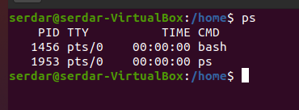


Genel olarak sistem üzerinde ki tüm işlemleri görmek, sistemde ve terminallerde çalışan tüm süreç ve sahiplerini göstermek için;

```
ps -aux
```

komutunu kullanırız.

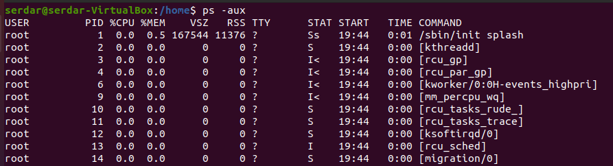

Komutumuzu kullandık ve karşımıza listemiz geldi. Peki listede ki bu sütun başlıkları ne anlama gelmektedir?

```
USER : Sürecin sahibi olan kullanıcı.
PID  : Sürecin unique değeri.
%CPU : CPU kullanımının yüzde kaçının ilgili sürece ait olduğu.
%MEM : Sürecin belleğin yüzde kaçını kullandığı bilgisi.
VSZ  : Sürecin kullandığı sanal bellek bilgisi.
RSS  : Sürecin kullandığı fiziksel bellek bilgisi.
TTY  : Süreci kontrol eden terminal.
STAT : Sürecin o anki durumu. Bazı STAT değerlerinin anlamları ;
    -S : Sürecin beklemede olduğunu gösterir. (kesilebilir uyku, olayın tamamlanmasını beklemek)
    -R : Sürecin o an çalıştığını,CPU'da işlem gördüğünü belirtir. (Çalışıyor veya çalıştırılabilir )
    -D : Süreç kesilemez bir şekilde uykuda.
    -T : Sürecin debugger'da incelendiğini ya da durdurulduğunu gösterir.
    -Z : Süreç zombi durumunda.
    -X : Ölü durumda
    
    < : Yüksek Öncelikli
    N : Düşük Öncelikli
    S : Oturum Lider
    l : Çok İş Parçacıklı
    + : Ön Plan Süreç Grubu
    
START : Sürecin başlangıç zamanı.
TIME : Sürecin CPU'da harcadığı süre.
COMMAND :  Sürecin adı ve komut satırı parametreleri.


```


e : Sistemde çalışan her süreçtir.

```
ps -e
```


u : Kullanıcı adına göre süreç bilgileri verir.

```
ps -u <kullanici>
ps -u serdar
```


p : Süreç numarasına(PID) göre süreç bilgisi verir.

```
ps -p <PID-Numarasi>
ps -p 1
```


Bir süreci özel olarak aramak istersek `grep` komutunu kullanabiliriz. Bu komut yardımıyla istediğimiz süreci getirir ve bilgileri görebiliriz. Örnek olarak;

```
ps -aux | grep <süreçAdı>
ps -aux | grep "bash"
```


## 2-pstree

Süreçleri hiyerarşik şekilde görüntülememizi sağlar. Örnek olarak;

```
pstree
```

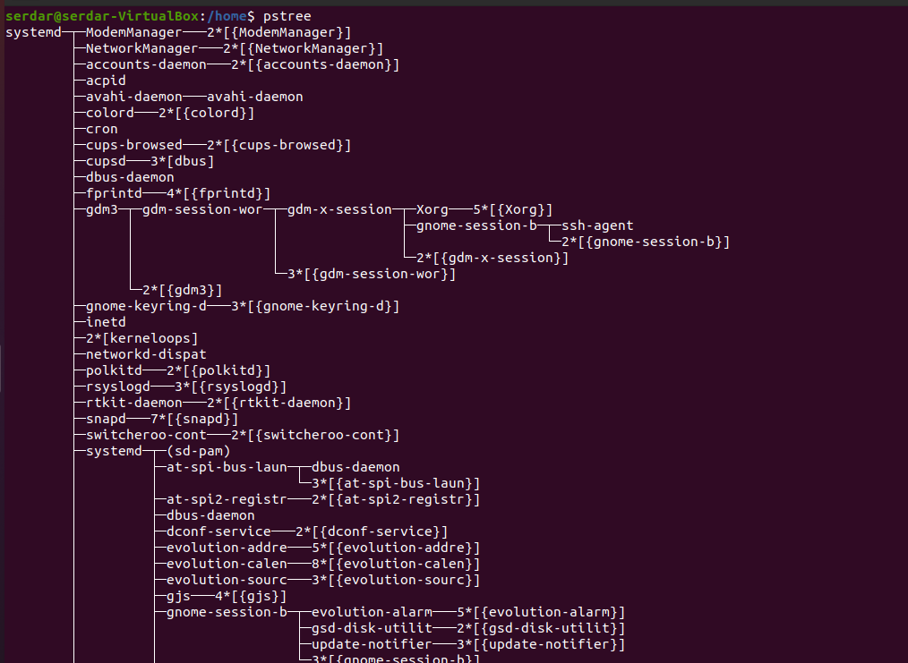


## 3-top

`top` komutu da `ps` komutunun yaptığı gibi süreçler hakkında bilgi verir ancak `ps` komutundan farklı olarak 3 saniyede bir yenilenecek şekilde anlık değişimleri gösterir.

Genel olarak kullanımı;

```
top
```

Diğer bir kullanımında **kaç saniyede bir yenileneceğini kendimiz seçebiliriz**

Bunun için `-d` parametresini kullanırız. Örnek Kullanımı;

```
top -d <saniye>
top -d 1
```


Süreç tablosundan çıkmak istersek `q` tuşuna basmamız yeterli olacaktır.


## 4-pgrep

Çalışan süreçlerin PID numarasını bulmamızı sağlayan komuttur.

Bir sürecin adını biliyorsak ve `PID` numarasını öğrenmek istersek bu komutu kullanabiliriz.

Örnek kullanımı şu şekildeldir;

```
pgrep <süreçAdi>
pgrep "bash"
```

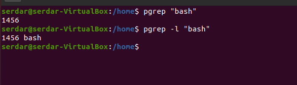


Örneğin biz süreç sahibinin(hedef kullanıcı), süreç isimleriyle beraber numaralarını da görmek istersek;

```
pgrep -lu <kullanici>
pgrep -lu serdar
```


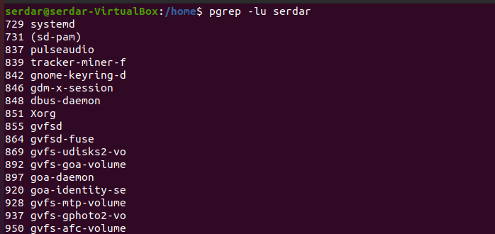


## 5-kill-killall

Süreçleri sonlandıma işleminde kullanılmaktadır. 

```
kill <süreçNumarası(PID)>
kill 2360
```

Süreç numarası ile süreci sonlandırır.


```
kill -9 <süreçNumarası(PID)>
kill -9 2470
```

Kapanmaya karşı direnen süreçleri `-9` parametresi ile sonlandırabiliriz.

------------


```
killall <süreçAdı>
killall armitage
```

`killall` komutu ile süreçleri ismiyle sonlandırırız.


```
killall -9 <süreçAdı>
killall -9 armitage
```

`-9` parametresiyle kapanmaya direnen süreçleri ismiyle sonlandırırız.


## 6-xkill

Yanıt vermeyen bir programı grafik arayüzünden fare imlecimiz ile kapatmamızı sağlar. Komutu yazdıktan sonra fare imlecimizde "X" (Çarpı) işareti belirir. Daha sonra kapatmak istediğimiz programa fare ile tıklayarak kapanmasını sağlarız.

```
xkill
```


## 7-fg-bg-jobs

Bu üç komutumuz (`fg` , `bg`, `jobs`)  işlem süreçlerini yönetmemize yardımcı olmaktadır.

Biz konsoldan bir komut verdiğimiz zaman **işlem sürecimiz bitmeden konsoldan başka bir komut vermemiz mümkün değildir.**

Böyle bir durumda yeni bir komut girişi yapmak istersek ***konsolda çalışan sürecimizi arka plana alarak*** komutumuzu bu şekilde çalıştırabiliriz.

İşte bu üç komutumuzda;

 konsolda çalıştırdığımız süreci arkaplana

arkaplanda ki süreci ön plana taşıma işleve sahiptir.

`Jobs` komutu ise bu sürecin durumunu takip etmemize olanak sağlamaktadır. 


Şimdi bir örnek ile bunu yapalım.   **Konsoldan** 'firefox' uygulamasını açıyorum.


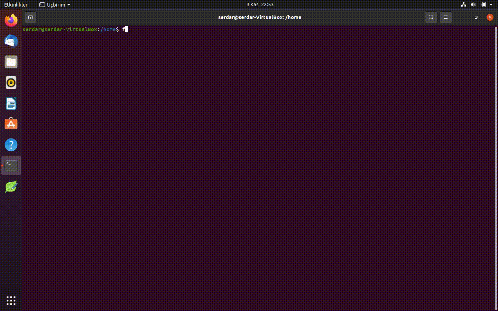


Konsolumuz artık *firefox* uygulamasını çalıştırmakla meşgul. Yani *firefox* açıkken konsol üzerinden yeni bir komut girmemiz mümkün değildir.  Bu sebeple konsol üzerinde çalışan *firefox* uygulamasını **`ctrl+z` tuşu ile durdurup arka plana atmalıyız.** 

Bu işlemle konsol üzerinde çalışan *firefox* uygulamasını **durdurup** arka plana atılacaktır.

Böylece konsolumuz yeni komutları girmeye müsait olacaktır ve *firefox* uygulamasıyla meşgul olmayacaktır.

İlk `ctrl+z` komutumuzla konsol uygulamanın durdurulduğu bilgisini verecektir. Ancak biz sonrasında **durdurulan uygulamayı görmek istersek** **`jobs`** komutunu kullanırız.

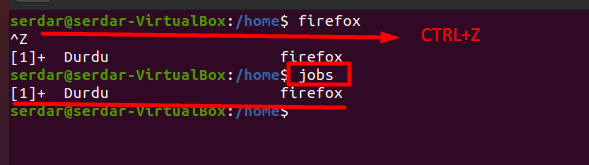

Böylece *firefox* uygulamasını durdurduk. Bu durumda **arayüzden firefox uygulaması üzerinde bir şeyler yapmaya çalıştığınızda işe yaramayacağını görebilirsiniz**. Uygulama arka planda durdurulup  *hazır* beklemektedir

Artık konsolumuza yeni komutlarımızı girebiliriz. 

Ancak biz **konsol üzerinden komutlarımızı verirken firefoxunda çalışmasını istiyoruz**

İşte bu durumda;

```
bg
```

komutumuzu kullanıyoruz. Böylece uygulamamız **arkaplanda çalışmaya** devam ediyor. Hem konsoldan komutlarımızı giriyoruz hem de firefox uygulamasını kullanabiliyoruz.


Eğer arkaplanda çalışan firefox uygulamamızı tekrar konsol üzerinden çalıştırmak istersek de;

```
fg
```

komutunu kullanıyoruz.


# LINUX DİSK İŞLEMLERİ

Diski formatlama, tarama, düzeltme, bölüm oluşturma vs. işlemleri gerçekleştirmek için bir takım komutlar vardır.

**HATIRLATMA** : Disk üzerinde işlem yapabilmek için o diskin sistem tarafından kullanılmaması gerekmektedir.


## 1-fdisk

Komut temel parametreler ile birlikte kullanılmaktadır.

Disk bölümlerini listelemek için `-l` parametresini alır.

```
fdisk -l
```


Parametresiz

```
fdisk /dev/sda
```

şeklinde kullanırız. Bu durumda karşımıza yardım menüsü gelecektir ve belirli parametreler ile yapılabilecekleri gösterecektir. Örnek olarak;

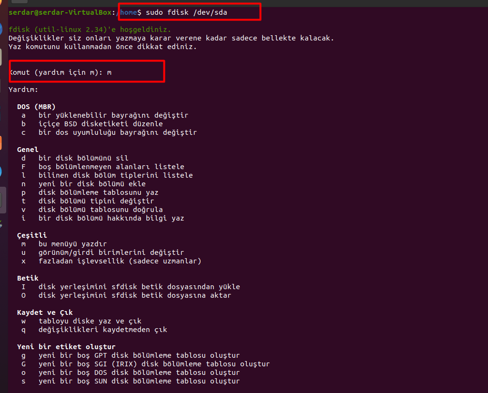

İstediğimiz parametreyi yazıp kullanabiliriz.


## 2-cfdisk

`fdisk`'in görsel arayüz versiyonudur. 

```
cfdisk
```

komutu ile açabiliriz.

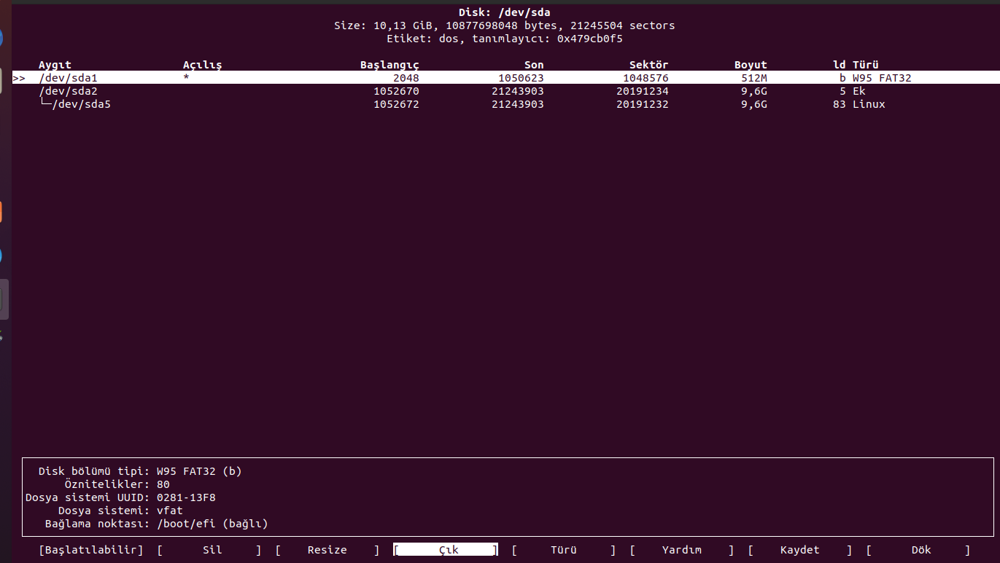


## 3-fsck

Disteki hatalı blokları düzeltmek için bu komutu kullanırız. Örnek olması açısından USB disk ile onarma işlemi yapalım.

Öncelikle USB diskinin  adını öğrenmek için `fdisk -l` komutunu kullanıyorum.

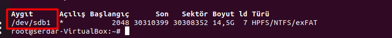


/dev/sdb1 USB diskin adıymış. Artık onarma işlemini yapabiliriz.

Bunun için;

```
fsck -p /dev/sdb1
```

komutunu kullanıyoruz.


## 4-df

`df` komutu disklerin ***dosya sistemi,boyutu,doluluk oranı,bağlandığı yer(mount)*** gibi bilgileri liste halinde verir.

Eğer çıktıların daha okunaklı olmasını(MB,GB) istiyorsak `-h` parametresini kullanabiliriz. 

```
df -h
```

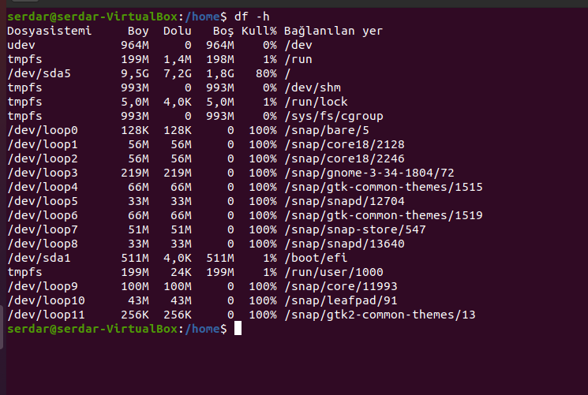

```
df -hm      MB cinsi
```

```
df -hk      KB cinsi
```


## 5-umount(Diski Bağlantıdan Koparmak)

Disk bağlantısının sistemden koparmak için `umount` komutunu kullanırız.

Öncelikle disk hakkında genel bilgi sahibi olmak için `df -h` komutunu kullanalım.

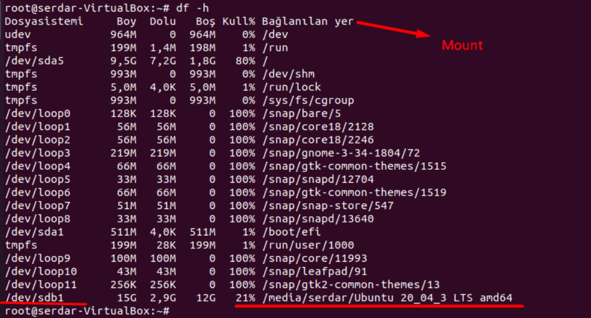

USB diskinin adı `/dev/sdb1` ve sisteme bağlandığı konum `/media/serdar/Ubuntu....` diziniymiş.

Gerekli bilgileri öğrendik. Artık USB diski sistemden çıkarabiliriz. Bunun için;

```
umount /dev/sdb1
```

komutunu kullanarak sistemden bağını koparabiliriz.

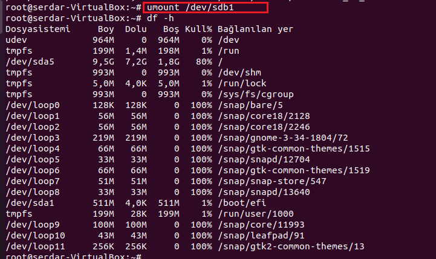

Artık sistem tarafından görünmüyor.


## mount(Diski Bağlamak)

Sistemden koparmış olduğumuz USB diski tekrar bağlamak için `mount` komutunu kullanırız.

```
mount <aygıtAdı> <BaglanılacakKonum>
```

Örneğin masaüstünde bir dizin oluşturup,  diskin bağlanacağı konum seçelim.

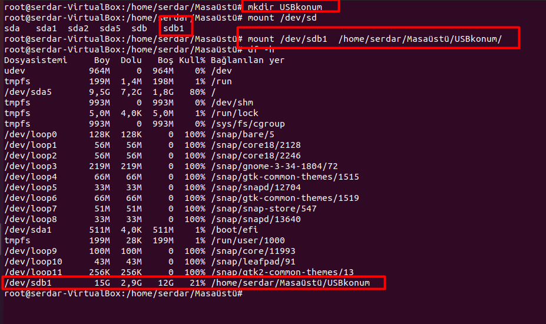


# **LINUX CONFIGURATION**


**İfconfig** komutu ile ipv4,ipv6,mac adresi öğrenilebilir.
## **1-Netplan kullanarak Static IP Yapılandırma**

Ip yapılandırma işlemi için netplan dosyasına erişmeliyiz. Bu dosya `/etc/netplan/` dizininin içerisinde bulunmaktadır.

Bu dosya Ubuntu 17.10 versiyonundan önce `etc/network/interfaces/` dizininin içerisinde bulunmaktaydı. Ancak yeni versiyonuyla beraber sistem değişikliğine gidildi.

Öncelikle ethernet cihaz adına bakalım;

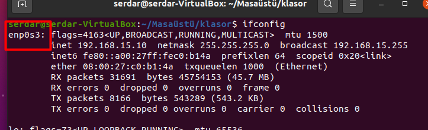

Daha sonra belirtilen dosya yoluna;

**`cd /etc/netplan/`** komutu ile girebiliriz.

Kullandığınız metin editörü ile dosyayı açalım.  (nano ile açabilirsiniz)


Öncelik olarak ethernets: altına ifconfigden öğrendiğimiz cihaz adını yazıyoruz.

Static istedğimiz için **`dhcp4: no`** -> hayır olarak işaretliyoruz

**Addresses** kısmına istediğimiz ip adresini atıyoruz. **/24** olan kısım ise ağ maskemiz.  255=8bit toplam 24 bit edecektir. **255.255.255.0 olarak atama** işlemi yapacaktır.

**gateway4:** ağ geçitimizin IP adresini atıyoruz.

Son olarak **DNS için nameservers**: altına **addresses:** kısmına yazıyoruz.

Ip adreslerinin **virgül ile ayrılması** gerekmektedir. Örneğin;

[8.8.8.8(virgül)8.8.4.4]

Dosyayı kaydettikten sonra yapılandırma dosyasını test etmeliyiz. Bunun için;

**`sudo netplan try`** komutunu kullanabiliriz.

Eğer herhangi bir sorun yoksa yapılandırma dosyasının kabul edildiğine dair mesaj gelecektir. Enter tuşu ile işlemi tamamlayabiliriz.

Ardından **yapılandırmayı uygulamak** için **`sudo netplan apply`** komutunu çalıştıralım. Böylece yapmış olduğumuz ayarlar tamamlanacaktır.

Ağ hizmetini yeniden başlatmak, durdurmak veya başlatmak için;

```
sudo service network-manager restart
sudo service network-manager stop
sudo service network-manager start
```

kullanılabilir.

# 


